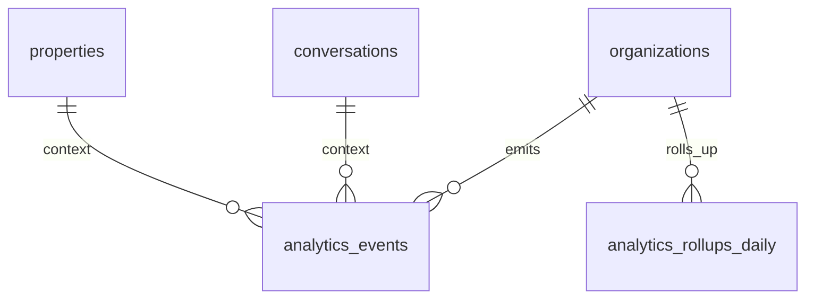
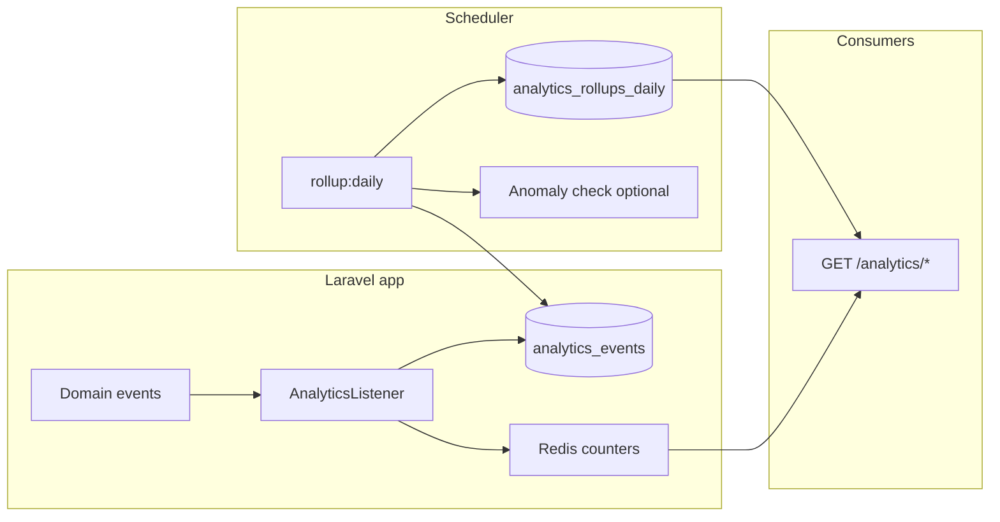

# Analytics Specification — Facebook Marketplace Auto-Responder

**Version**: 1.0  
**Inputs**: `artifacts/backend-api-spec.md`, `artifacts/product-requirements.md`, `artifacts/system-architecture.md`  
**Storage**: PostgreSQL + Redis; scheduler: Laravel cron

---

## 1. KPI Definitions & Metrics Catalog

| Metric ID | Name | Formula / definition | Source | Grain | Notes |
|-----------|------|----------------------|--------|-------|--------|
| `m_first_response_seconds` | Median first response time | `median(first_outbound_at - first_inbound_at)` per conversation | `messages`, `conversations` | Hourly / Daily | First outbound includes auto |
| `m_auto_send_rate` | Auto-send rate | `auto_sent_outbound / total_outbound * 100` | `messages` | Daily | Exclude human-edited if tagged |
| `m_human_intervention_rate` | Human intervention rate | `conversations_with_review_task / conversations_started * 100` | `review_tasks`, `conversations` | Daily | |
| `m_flag_rate` | Flag rate | `messages where escalation!=none / inbound * 100` | `messages` | Daily | |
| `m_conversation_volume` | Conversation volume | `count(distinct conversation_id)` | `conversations` | Hourly / Daily | |
| `m_active_conversations` | Active threads | Open states not in terminal | `conversations` | Real-time snapshot | Redis counter optional |
| `m_screening_avg` | Avg screening score | `avg(latest_snapshot.aggregate)` | `screening_snapshots` | Daily | |
| `m_screening_pass_rate` | Pass rate | `% with score >= auto_send_min` | snapshots + thresholds | Daily | Per org threshold |
| `m_inquiry_to_visit` | Inquiry → visit proposed | Funnel stage counts | events + state transitions | Daily | Requires `visit_proposed` event |
| `m_visit_to_confirm` | Visit proposed → confirmed | Ratio | events | Daily | Optional |
| `m_property_rank` | Conversations per property | `group by property_id` | `conversations` | Daily | |
| `m_llm_tokens` | LLM token usage | `sum(tokens)` | `llm_invocations` (from backend) | Daily | Cost KPI |
| `m_error_rate` | Ingest / delivery errors | Extension `delivery-result failed` ratio | logs / table | Daily | |

**Product alignment** (`product-requirements.md` Success Metrics): time saved (derived), median first response, auto-resolution rate, review SLA, conversion funnel, flag precision (sampled), tenant proxy optional.

---

## 2. Analytics Data Model

### 2.1 `analytics_events` (raw)

| Column | Type | Description |
|--------|------|-------------|
| `id` | bigserial | |
| `organization_id` | uuid | |
| `event_type` | string | e.g. `message.ingested`, `response.auto_sent`, `review.created` |
| `occurred_at` | timestamptz | UTC |
| `conversation_id` | uuid nullable | |
| `property_id` | uuid nullable | |
| `listing_id` | uuid nullable | |
| `payload_json` | jsonb | Small metadata; no large text |

**Indexes**: `(organization_id, occurred_at)`, `(event_type, occurred_at)`.

### 2.2 `analytics_rollups_daily`

| Column | Type |
|--------|------|
| `organization_id` | uuid |
| `date` | date (UTC) |
| `property_id` | uuid nullable (null = org total) |
| `metrics_json` | jsonb — keyed metric IDs |

### 2.3 `analytics_rollups_hourly` (optional)

Same shape with `hour` timestamptz bucket for “today” charts.

### 2.4 Relationships (Mermaid)



---

## 3. Metrics Collection Pipeline



**Event → `analytics_events` mapping (examples)**

| Laravel event | `event_type` | `payload_json` keys |
|---------------|--------------|---------------------|
| `MessageIngested` | `message.ingested` | `direction`, `has_text` |
| `ResponseGenerated` | `response.generated` | `escalation`, `auto` |
| `OutboundSent` | `response.sent` | `auto_sent`, `latency_ms` |
| `ReviewTaskCreated` | `review.created` | `reason_codes[]` |
| `ScreeningUpdated` | `screening.updated` | `aggregate` |

---

## 4. Real-Time Counters (Redis)

| Key pattern | TTL | Incr when |
|-------------|-----|-----------|
| `analytics:org:{id}:today:auto_sent` | 36h | `OutboundSent` auto |
| `analytics:org:{id}:today:flagged` | 36h | `ReviewTaskCreated` |
| `analytics:org:{id}:today:ingested` | 36h | `MessageIngested` inbound |

**Daily reset**: Prefer **date bucket** in key `analytics:org:{id}:2026-03-31:auto_sent` to avoid TTL edge cases, or flush via scheduled job at UTC midnight per org timezone (phase 2).

---

## 5. Batch Aggregation Jobs

### 5.1 Command: `analytics:rollup-daily`

- Window: previous UTC day (or catch-up).  
- For each org: compute metrics from `analytics_events` + `messages`/`conversations` as needed; upsert `analytics_rollups_daily`.  
- Idempotent per `(org, date, property_id)`.

### 5.2 Command: `analytics:rollup-hourly` (optional)

- Last 48 hours sliding window for dashboard charts.

### 5.3 SQL sketch (daily volume)

```sql
SELECT organization_id,
       date_trunc('day', occurred_at AT TIME ZONE 'UTC') AS d,
       COUNT(*) FILTER (WHERE event_type = 'message.ingested') AS ingest_count
FROM analytics_events
WHERE occurred_at >= :from AND occurred_at < :to
GROUP BY 1, 2;
```

---

## 6. Dashboard Data Endpoints

### 6.1 `GET /api/v1/analytics/overview`

**Query**: `timezone` (IANA), `compare` = `previous_period` optional.

**Example JSON**

```json
{
  "range": { "from": "2026-03-24", "to": "2026-03-31", "timezone": "America/Montreal" },
  "today": {
    "auto_sent": 23,
    "flagged": 3,
    "median_first_response_seconds": 720,
    "active_conversations": 15
  },
  "compare": {
    "median_first_response_seconds": { "delta_pct": -8.2 },
    "auto_sent": { "delta_pct": 12.0 }
  }
}
```

### 6.2 `GET /api/v1/analytics/timeseries`

**Query**: `metric`, `from`, `to`, `grain` (`hour|day`), `property_id` optional.

**Example**

```json
{
  "metric": "conversation_volume",
  "grain": "day",
  "points": [
    { "t": "2026-03-25", "v": 42 },
    { "t": "2026-03-26", "v": 38 }
  ]
}
```

### 6.3 `GET /api/v1/analytics/funnel`

Stages: `inquiry`, `screening_complete`, `visit_proposed`, `visit_confirmed` — backed by state transition events (emit when `conversations.current_state` changes).

### 6.4 `GET /api/v1/analytics/properties`

Table data: per-property volume, median response, flag rate for date range.

---

## 7. Trend Calculations & Comparisons

- **WoW / MoM**: Compare full current period to immediately preceding period of equal length.  
- **Moving average**: 7-day MA on daily `conversation_volume` for smoothing.  
- **Anomaly (optional)**: Z-score on `flag_rate` vs trailing 28d; surface “unusual week” banner in UI only if > 2σ.

---

## 8. Reporting Features

| Feature | MVP | Notes |
|---------|-----|--------|
| Date range filter | Yes | URL query sync |
| Compare previous period | Yes | Overview + timeseries |
| CSV export | Should | `GET /analytics/export?format=csv` streamed |
| PDF export | Could | Later |
| Weekly email summary | Could | Mailable + org preference flag |

**Weekly email (outline)**

- KPIs: volume, median response, auto rate, top flagged reasons  
- Link to dashboard analytics

---

## 9. Data Retention Policy

| Dataset | Retention |
|---------|-----------|
| `analytics_events` raw | **90 days** (per persona parameters) |
| `analytics_rollups_daily` | **2 years** |
| `analytics_rollups_hourly` | **90 days** |
| Monthly archive (optional) | Indefinite aggregate table `analytics_rollups_monthly` |

Purge job: `analytics:prune-events` weekly.

---

## 10. Performance Considerations

- Partition `analytics_events` by month (PostgreSQL declarative partitioning) if > 10M rows.  
- Rollups read raw only for daily job, not dashboard.  
- Dashboard **overview** uses Redis today + yesterday partial rollup + `analytics_rollups_daily` for trends.  
- Avoid `payload_json` heavy scans — metrics in columns where hot.  
- Index `(organization_id, occurred_at)` + BRIN on `occurred_at` optional for append-heavy.

---

## Definition of Done (Analytics Engineer)

- [x] KPI catalog covering response, conversation, screening, conversion, property, system.  
- [x] Data model: events + daily/hourly rollups; pipeline diagram.  
- [x] Redis counters + batch jobs + endpoint examples.  
- [x] Trends, comparisons, reporting, retention, performance.  
- [x] Aligned with backend events and UX analytics pages.
