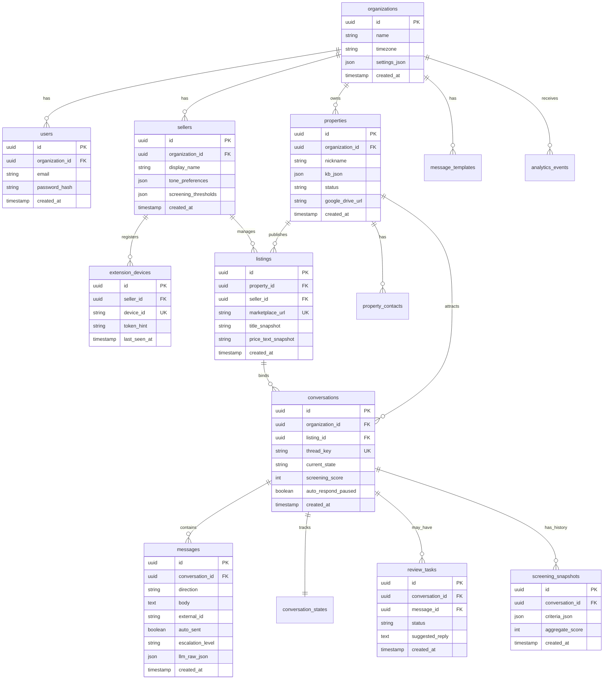
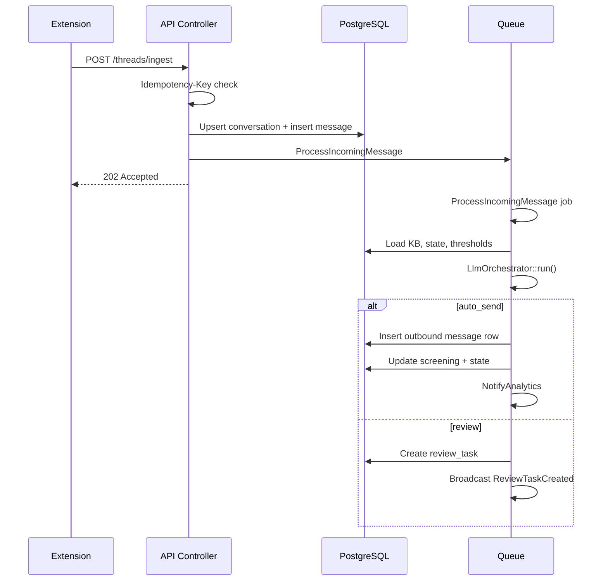

# Backend API Specification — Facebook Marketplace Auto-Responder

**Version**: 1.0  
**Inputs**: `artifacts/system-architecture.md`, `artifacts/conversation-system-design.md`, `artifacts/browser-extension-spec.md`  
**Prefix**: `/api/v1`  
**Auth**: Laravel Sanctum — SPA session for dashboard; **Bearer token** (personal access token) for extension

---

## 1. Database Schema

### 1.1 ER diagram (Mermaid)

### 1.2 Key columns (supplementary)

| Table | Notes |
|-------|--------|
| `property_contacts` | `name`, `phone_e164`, `role`, `property_id` |
| `message_templates` | `slug`, `locale`, `body`, `organization_id` |
| `oauth_connections` | `organization_id`, `provider`, `encrypted_refresh_token`, `scopes[]` |
| `conversation_states` | Optional 1:1 — `state_enum`, `release_visit_credentials` bool |
| `analytics_events` | `type`, `organization_id`, `payload_json`, `occurred_at` |

**Indexes (representative)**

- `conversations (organization_id, listing_id, created_at)`  
- `messages (conversation_id, created_at)`  
- `messages (external_id)` partial where not null  
- `analytics_events (organization_id, occurred_at)`  

---

## 2. API Endpoint Specification

### 2.1 Auth & extension pairing

| Method | Path | Description | Auth |
|--------|------|-------------|------|
| POST | `/auth/register` | Org + owner user (MVP) | Public |
| POST | `/auth/login` | Dashboard session | Public |
| POST | `/auth/logout` | Invalidate session | Sanctum cookie |
| POST | `/api/v1/auth/extension/token` | Issue PAT for `device_id` | Sanctum (dashboard) |
| POST | `/api/v1/auth/extension/revoke` | Revoke device token | Sanctum |
| POST | `/api/v1/auth/extension/refresh` | Optional token rotation | Bearer |

### 2.2 Extension (Bearer PAT)

Aligned with `browser-extension-spec.md`.

| Method | Path | Description |
|--------|------|-------------|
| POST | `/api/v1/threads/ingest` | Inbound message; `Idempotency-Key`; returns `202` |
| GET | `/api/v1/extension/outbox` | Pending outbound messages since cursor |
| POST | `/api/v1/messages/{id}/delivery-result` | `sent` / `failed` + error |
| POST | `/api/v1/extension/mode` | `{ "auto_respond": boolean }` |
| POST | `/api/v1/extension/resolve-listing` | Map URL/title → `listing_id` |

### 2.3 Properties, listings, KB

| Method | Path | Description |
|--------|------|-------------|
| GET/POST | `/api/v1/properties` | List / create |
| GET/PATCH/DELETE | `/api/v1/properties/{id}` | CRUD |
| PATCH | `/api/v1/properties/{id}/kb` | Partial KB JSON update |
| GET/POST | `/api/v1/listings` | CRUD + link `marketplace_url` |
| PATCH | `/api/v1/listings/{id}` | Update snapshots |

### 2.4 Conversations & messages (dashboard)

| Method | Path | Description |
|--------|------|-------------|
| GET | `/api/v1/conversations` | Filters: property, state, flagged |
| GET | `/api/v1/conversations/{id}` | Detail + last messages |
| GET | `/api/v1/conversations/{id}/messages` | Paginated thread |
| PATCH | `/api/v1/conversations/{id}` | Pause, assign, notes |

### 2.5 Review queue

| Method | Path | Description |
|--------|------|-------------|
| GET | `/api/v1/review-tasks` | `status=open` default |
| PATCH | `/api/v1/review-tasks/{id}` | Approve with optional `edited_body` |
| POST | `/api/v1/review-tasks/{id}/send` | Finalize send → queue extension outbox |

### 2.6 Templates & settings

| Method | Path | Description |
|--------|------|-------------|
| CRUD | `/api/v1/templates` | Message templates by slug/locale |
| GET/PATCH | `/api/v1/organizations/current/settings` | Org defaults |

### 2.7 Integrations

| Method | Path | Description |
|--------|------|-------------|
| GET | `/api/v1/integrations/google` | Connection status |
| GET | `/api/v1/integrations/google/redirect` | Start OAuth |
| GET | `/api/v1/integrations/google/callback` | OAuth callback |

### 2.8 Analytics (summary; detail in `analytics-spec.md`)

| Method | Path | Description |
|--------|------|-------------|
| GET | `/api/v1/analytics/overview` | Today + deltas |
| GET | `/api/v1/analytics/timeseries` | Query params: metric, from, to, grain |

---

## 3. Authentication & Authorization

- **Dashboard**: SPA uses Sanctum cookie (`SANCTUM_STATEFUL_DOMAINS`) or token SPA pattern.  
- **Extension**: PAT with abilities `extension:ingest`, `extension:outbox`.  
- **Policies**: `PropertyPolicy`, `ConversationPolicy` — `user.organization_id === model.organization_id`.  
- **Global scopes**: `BelongsToOrganization` on tenant-owned models.

---

## 4. Message Processing Pipeline

**Jobs**

| Job | Responsibility |
|-----|----------------|
| `ProcessIncomingMessage` | Dedupe, LLM, persist, branch auto vs review |
| `DeliverOutboundToExtension` | Mark outbox rows for SW polling (or push) |
| `ApplyHumanReviewDecision` | Merge edited text, enqueue send |
| `AggregateAnalyticsDaily` | Rollups (see analytics spec) |

---

## 5. Queue Architecture

- **Driver**: Redis (`QUEUE_CONNECTION=redis`).  
- **Queues**: `default`, `llm`, `analytics` (separate workers for LLM rate limits).  
- **Horizon** (optional): monitor retries, throughput.  
- **Failure**: `failed_jobs` table; dead-letter alert.

---

## 6. LLM Integration Layer

- **Service**: `App\Services\Llm\LlmOrchestrator`  
- **Input**: Assembled from `conversation-system-design.md` — system prompt, developer policy line, user payload with transcript + `property_kb_json`.  
- **Output**: Validate JSON schema (e.g. `json-schema` or DTO validator); map to:
  - `messages` draft row  
  - `conversations.current_state` update  
  - `screening_snapshots` append  
  - `escalation_level` → review vs auto  
- **Idempotency**: `llm_invocations` table with `message_id` unique to prevent double spend.  
- **Cost**: Store token usage on invocation row; daily org budget in Redis.

---

## 7. Tenant Screening System

- **Criteria / weights**: Per `conversation-system-design.md` §7; stored in `sellers.screening_thresholds` + org defaults.  
- **Computation**: Worker merges LLM `score_deltas` into latest snapshot; recomputes weighted aggregate 0–100.  
- **Actions**:  
  - `aggregate >= auto_send_min` and `escalation.none` → auto-send path  
  - `aggregate < flag_below` or policy conflict → `review_task`  
  - `release_visit_credentials` only when score + human flags allow

---

## 8. External Integrations

### 8.1 Google Drive

- OAuth scopes minimal (e.g. `drive.readonly` if only storing links — may need no Drive scope if URLs manual).  
- Store share URL on `properties.google_drive_url`; LLM injection via KB.

### 8.2 Google Calendar

- Scopes: `calendar.events`, `calendar.freebusy`.  
- Service: `CalendarService::suggestSlots()`, `createEvent()` on confirmed visit.  
- Tokens: `oauth_connections` encrypted casts.

### 8.3 LLM provider

- Env: `LLM_PROVIDER`, `LLM_API_KEY`, `LLM_MODEL`.  
- Retries: 3x exponential; on hard fail create `review_task` with stall template.

---

## 9. Multi-Tenant Architecture

- **Resolution**: `auth()->user()->organization_id` for dashboard; PAT carries `seller_id` + `organization_id` in token metadata or join on `seller`.  
- **Rate limiting**: `RateLimiter::for('ingest', ...)` keyed by `organization_id`.  
- **Isolation tests**: PHPUnit ensures cross-org 404 on UUID guess.

---

## 10. Event System & WebSocket Broadcasting

| Event | Payload focus | Listeners |
|-------|---------------|-----------|
| `MessageIngested` | conversation id | Analytics listener |
| `ResponseGenerated` | message id | Analytics |
| `ReviewTaskCreated` | task id | Broadcast `private-tenant.{org}` |
| `ScreeningUpdated` | conversation id | Broadcast |
| `OutboundSent` | message id | Analytics |

**Channels**: `private-tenant.{organizationId}`, optionally `private-conversation.{id}`.

---

## 11. Error Handling & Logging

- **API**: Problem JSON (`type`, `title`, `status`, `detail`) for 4xx/5xx.  
- **Logging**: Structured JSON; never log full message body in production without redaction.  
- **Idempotency**: `409` or `202` with `duplicate: true` for replayed ingest.

---

## 12. Migration Strategy

1. Core tables: `organizations`, `users`, `sellers`, `properties`, `listings`, `conversations`, `messages`.  
2. Screening + review: `screening_snapshots`, `review_tasks`.  
3. Templates + OAuth + devices.  
4. Analytics: `analytics_events`, rollup tables (per analytics spec).  
5. Seed dev tenant + example property KB JSON.

---

## Definition of Done (Backend Engineer)

- [x] Schema covers tenants, properties, listings, conversations, messages, templates, screening, review, analytics events.  
- [x] REST groups documented; extension paths match `browser-extension-spec.md`.  
- [x] Pipeline + jobs + LLM layer + screening alignment with `conversation-system-design.md`.  
- [x] Google + LLM integration; multi-tenant + events + WebSockets.  
- [x] Errors, logging, migrations outlined.
