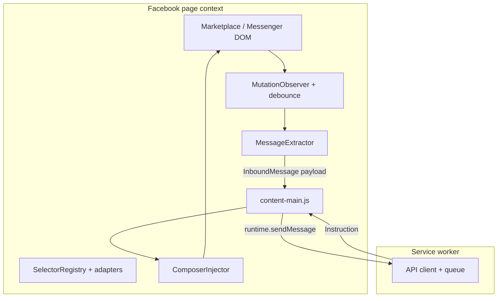
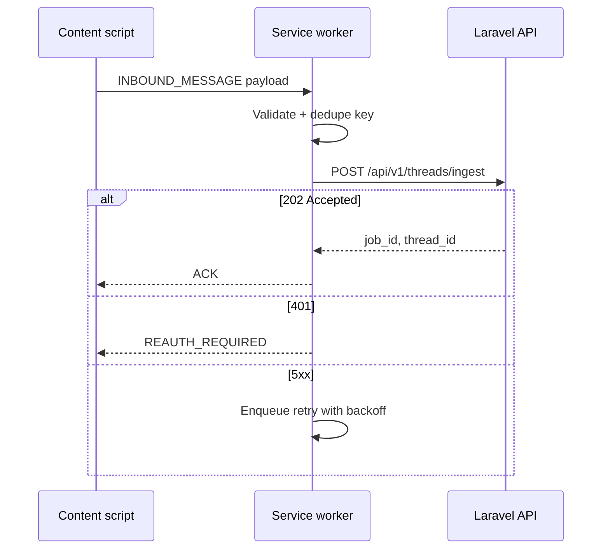
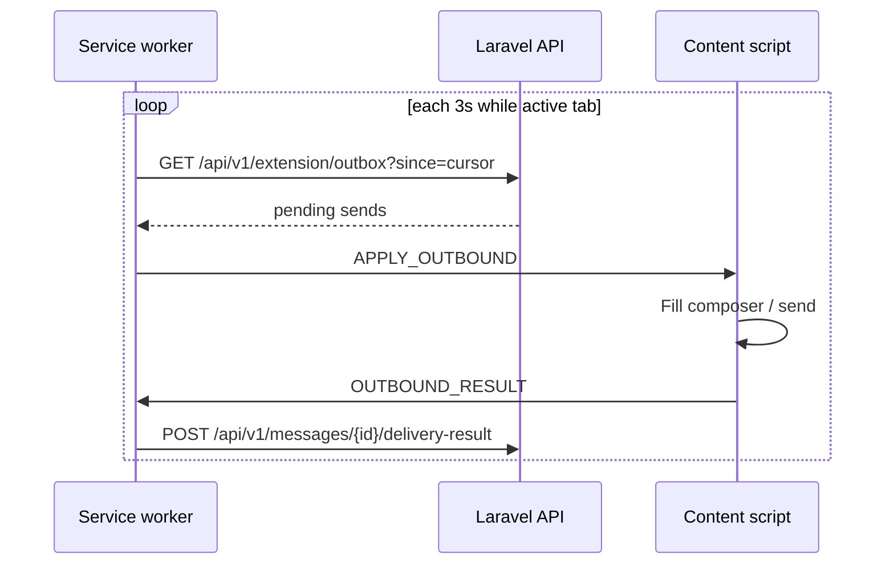

# Browser Extension Specification — Facebook Marketplace Auto-Responder

**Version**: 1.0  
**Input**: `artifacts/system-architecture.md`  
**Stack**: Manifest V3 (Chrome primary, Firefox secondary)

---

## 1. Extension Manifest Design

### 1.1 Chrome (Manifest V3) — reference manifest

```json
{
  "manifest_version": 3,
  "name": "Marketplace Auto-Responder",
  "version": "0.1.0",
  "description": "Syncs Facebook Marketplace rental conversations with your dashboard and automation backend.",
  "permissions": [
    "storage",
    "alarms",
    "scripting"
  ],
  "host_permissions": [
    "https://www.facebook.com/*",
    "https://m.facebook.com/*",
    "https://api.yourdomain.com/*"
  ],
  "background": {
    "service_worker": "background/service-worker.js",
    "type": "module"
  },
  "action": {
    "default_popup": "popup/popup.html",
    "default_title": "Marketplace Auto-Responder"
  },
  "options_ui": {
    "page": "options/options.html",
    "open_in_tab": true
  },
  "content_scripts": [
    {
      "matches": [
        "https://www.facebook.com/marketplace/*",
        "https://www.facebook.com/messages/*",
        "https://www.facebook.com/messaging/*"
      ],
      "js": ["content/content-main.js"],
      "run_at": "document_idle",
      "all_frames": false
    }
  ],
  "web_accessible_resources": [
    {
      "resources": ["injected/page-bridge.js"],
      "matches": ["https://www.facebook.com/*"]
    }
  ]
}
```

**Notes**

- **Facebook URLs**: Marketplace threads often open under `/marketplace/item/...` or redirect into **Messenger** UI (`/messages/t/`, `/messages/e2ee/...`). Content scripts must match **both** `marketplace` and `messages` paths (per persona parameters).  
- **API host**: Replace `api.yourdomain.com` with production/staging API; dev builds may inject `http://localhost` via `host_permissions` in unpacked builds only.  
- **CSP**: No `eval`; bundle with Vite/Rollup for the extension package.

### 1.2 Firefox adaptations

| Area | Chrome | Firefox |
|------|--------|---------|
| Service worker | MV3 `background.service_worker` | Supported (MV3); verify `browser.*` polyfill |
| APIs | `chrome.*` | Use `webextension-polyfill` → `browser.*` |
| `host_permissions` | Explicit | Same in MV3 |
| Persistent background | Not persistent SW | Same; use `alarms` for wake-up |

Ship a single codebase with **`webextension-polyfill`** and feature detection for `chrome.scripting` vs fallback.

### 1.3 Permission rationale

| Permission | Use |
|------------|-----|
| `storage` | Auth token, queue, extension settings |
| `alarms` | Backoff polling when observers miss or SW sleeps |
| `scripting` | Optional programmatic inject if match patterns need narrowing |
| Host `facebook.com` | Content scripts + DOM access |
| Host API | HTTPS calls from service worker |

---

## 2. Content Script Architecture



**Modules (logical)**

- **`SelectorRegistry`**: versioned selector maps (`selectors.v1.json`); one place to patch when Meta changes DOM.  
- **`ThreadContextResolver`**: derives `thread_fingerprint`, `listing_id` or URL slug, participant labels from aria/DOM heuristics.  
- **`MessageExtractor`**: maps DOM nodes → `{ id, direction, text, sent_at_estimate, raw_html_hash }`.  
- **`Deduper`**: suppresses re-posting same message `id` / hash within TTL.  
- **`ComposerInjector`**: sets textarea/contenteditable, dispatches input events, optionally clicks Send **only** when backend approved auto-send.

**Injection**

- Primary: declarative `content_scripts` in manifest.  
- Fallback: `chrome.scripting.executeScript` from SW on `tabs.onUpdated` if Facebook moves routes to unmatched paths (log + telemetry).

---

## 3. Facebook Marketplace DOM Interaction Strategy

### 3.1 Principles

1. **Never rely on a single class name** — Meta uses hashed classes; prefer **role**, **data attributes** (when stable), **structure** (conversation root → scrollable list → row), and **ARIA**.  
2. **Adapter pattern**: `MessengerAdapter` vs `MarketplaceAdapter` if layout diverges.  
3. **Self-test hook**: `window.__FMAR_DEBUG__` (dev only) dumps last resolved thread id and message count.

### 3.2 Example selector strategy (illustrative — verify live)

Facebook changes frequently; treat these as **patterns**, not contracts:

| Target | Strategy |
|--------|----------|
| Message list container | `[role="grid"]`, `[role="log"]`, or main `[role="main"]` descendant with scrollable overflow |
| Message row | `[data-scope="messages_table"]` *if present*; else row elements under list with time subnodes |
| Message text | Last `span`/`div` cluster in row; strip system strings (“You sent”, “Vu”) |
| Composer | `div[contenteditable="true"]` inside footer region; or `textarea` in older UIs |
| Send control | `div[role="button"]` near composer with aria-label matching send |

```javascript
// Pattern: observe stable ancestor, diff children
const root = document.querySelector('[role="main"]') ?? document.body;
const observer = new MutationObserver(
  debounce(() => scanForNewMessages(root), 120)
);
observer.observe(root, { childList: true, subtree: true });
```

### 3.3 Sending automation

- **Auto-send path**: Composer filled → `input`/`change` events → short delay → click Send.  
- **Human-guard**: If backend returns `escalation: review`, extension **does not** click Send; opens popup badge / in-page toast “Response waiting in dashboard.”

### 3.4 Listing ↔ property mapping

- Parse **Marketplace item URL** or **sidebar title**; send to API: `POST /api/v1/extension/resolve-listing` with `{ url, title_guess }` → API returns `listing_id` / `property_id` or `409` if unmapped (prompt user in dashboard).

---

## 4. Service Worker Design

### 4.1 Responsibilities

- Hold **Sanctum personal access token** (or OAuth access token) in `chrome.storage.local` (never `sync` for secrets).  
- **`fetch` to Laravel** with `Authorization: Bearer <token>`, `X-Extension-Version`, `X-Device-Id` (UUID generated once).  
- **Offline queue**: `IndexedDB` or `storage.local` queue of payloads; drain on `online` + alarm.  
- **Alarm `poll.fallback`**: every 2–5 min when tab active flag set but no ingest for N minutes (configurable).  
- **Token refresh**: on `401`, call `POST /api/v1/auth/extension/refresh` if implemented, else notify user to re-pair from dashboard.

### 4.2 Sequence: ingest inbound message



### 4.3 Sequence: poll outbound instruction



*(Polling is a reliable MVP pattern; WebSocket from background is possible later with shared worker constraints.)*

---

## 5. Extension UI (Popup / Overlay)

### 5.1 Popup (ASCII)

```
+--------------------------------------------------+
|  Marketplace Auto-Responder              [ v0.1 ] |
+--------------------------------------------------+
|  Status:  (o) Connected    Org: St-Henri PM      |
|  Mode:    [*] Auto-respond   ( ) Paused           |
+--------------------------------------------------+
|  Today:  Auto-sent: 23   Flagged: 3   Errors: 0   |
|  Thread: 4731 Chabot (screening)                  |
+--------------------------------------------------+
|  [ Pause auto-respond ]  [ Open dashboard ]       |
|  [ Reconnect / Sign in ]   [ Extension settings ]   |
+--------------------------------------------------+
|  Flagged > Click opens dashboard review queue       |
+--------------------------------------------------+
```

**Interactions**

- **Pause**: `POST /api/v1/extension/mode` `{ "auto_respond": false }`; content script checks flag before send.  
- **Badge**: `action.setBadgeText` for flagged count (cap "9+").

### 5.2 In-page overlay (minimal)

- Small **floating chip** (draggable, remembers position in `storage.local`): “FMAR • Auto” / “FMAR • Paused” / “FMAR • Review needed”.  
- Click opens popup or dashboard deep link.  
- **No** large overlays over Messenger (blocks usage); keep ≤ 40px height.

---

## 6. Message Flow (Extension ↔ Backend)

### 6.1 Payload: inbound ingest

`POST /api/v1/threads/ingest`

```json
{
  "device_id": "uuid",
  "thread_key": "fb-thread-fingerprint-stable",
  "listing": {
    "marketplace_url": "https://www.facebook.com/marketplace/item/...",
    "title_text": "3 1/2 ...",
    "price_text": "$1200"
  },
  "message": {
    "external_id": "hash-or-fb-id-if-found",
    "direction": "inbound",
    "text": "...",
    "observed_at": "2026-03-31T12:00:00Z"
  }
}
```

**Idempotency**: header `Idempotency-Key: sha256(thread_key + external_id + text)`.

### 6.2 Response: accepted

`202 Accepted`

```json
{
  "thread_id": "01JQ...",
  "duplicate": false
}
```

### 6.3 Outbox item

```json
{
  "message_id": "01JQ...",
  "text_fr": "...",
  "text_en": null,
  "mode": "auto_send",
  "expires_at": "2026-03-31T12:05:00Z"
}
```

---

## 7. Cross-Browser Compatibility

| Concern | Approach |
|---------|----------|
| APIs | `webextension-polyfill` |
| MV3 SW | Shared entry; Firefox tested in `about:debugging` |
| Build | One zip for Chrome; separate signed XPI pipeline for Firefox |
| Testing | Playwright **does not** replace manual smoke on both; use checklist per release |

**Compatibility matrix**

| Feature | Chrome | Firefox |
|---------|--------|---------|
| MV3 SW | Yes | Yes |
| `storage.local` | Yes | Yes |
| `alarms` | Yes | Yes |
| Content scripts on messenger | Verify | Verify |

---

## 8. Error Handling & Resilience

| Failure | Behavior |
|---------|----------|
| DOM breakage | Detect “zero messages parsed” for 5 min while URL looks like thread → show “Extension needs update” toast |
| Network offline | Queue ingest; exponential backoff; max queue size with drop-oldest + metric |
| Backend 5xx | Retry job; never double-send outbound without idempotency key |
| Token expired | Block auto-send; popup CTA re-auth |
| Rate limit `429` | Respect `Retry-After` |
| Extension update | `runtime.onInstalled` bump `SELECTOR_VERSION` cache |

---

## 9. Security Considerations

- **Secrets**: Only in `storage.local`; optional OS keychain future enhancement.  
- **CSP**: Strict extension CSP; no remote code.  
- **MITM**: TLS only; optional certificate pinning not standard in extensions — rely on host validation.  
- **XSS from Facebook**: Treat DOM text as **data**; never `innerHTML` for message content when reflecting to API.  
- **Least privilege**: Do not request `tabs` unless required; use `activeTab` pattern if scripting needs user gesture.  
- **Logging**: Truncate PII in debug logs.

---

## 10. Testing Strategy

| Layer | Tests |
|-------|--------|
| Unit | Extractor, dedupe, payload validation |
| Integration | Mock HTTP server for SW |
| Manual | Thread open, receive message, ingest 202, outbox send, pause mode |
| Selector health | Nightly job (optional) running headless against staging Facebook **not recommended** — use on-device telemetry |

---

## Definition of Done (Browser Extension Engineer)

- [x] MV3 manifest documented (Chrome + Firefox notes).  
- [x] Content script architecture, DOM strategy, abstraction layer.  
- [x] Service worker: auth, queue, alarms, API sequences.  
- [x] Popup + minimal overlay wireframed in spec.  
- [x] Extension ↔ backend message flow and payloads.  
- [x] Cross-browser, errors, security, testing.
