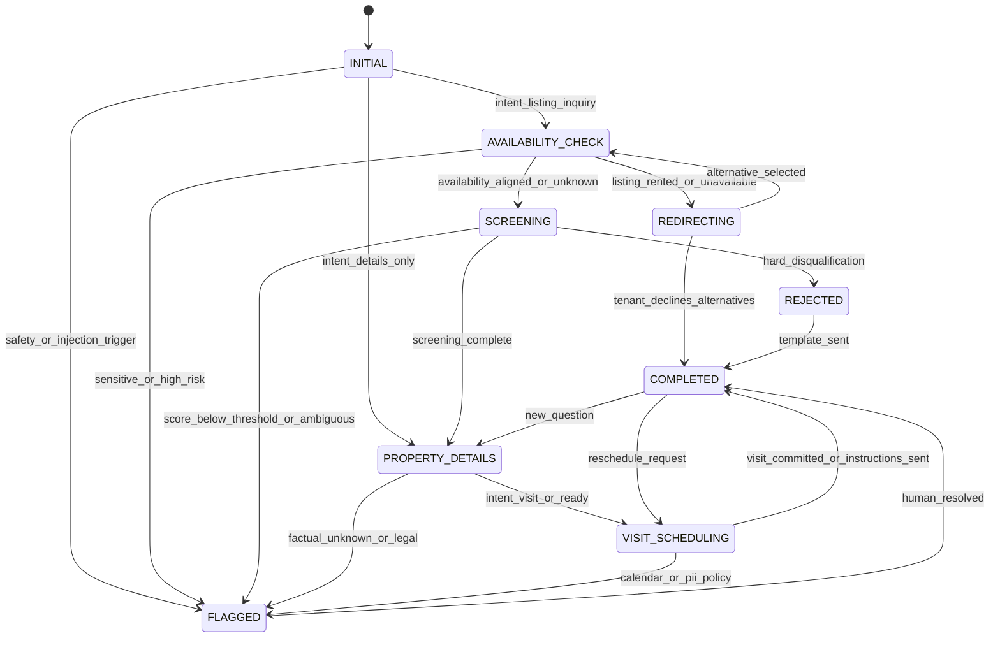

# Conversation System Design — Facebook Marketplace Auto-Responder

**Version**: 1.0  
**Inputs**: `artifacts/requirements.md`, `artifacts/product-requirements.md`  
**Output consumers**: System Architect, Backend Engineer, Browser Extension Engineer

---

## 1. Conversation Flow Analysis

### 1.1 Domain patterns (from requirements)

Real threads are not pasted verbatim in `requirements.md`; the orchestration assumes recurring **Montreal / Longueuil rental** flows across portfolios (e.g. Chabot, Gardenville, Cartier, Quinn, 6e Ave, Marmier, Adelaide). The following **canonical flow** matches the seven identified patterns:

| Step | Pattern | Typical tenant message (FR) | Typical assistant goal |
|------|---------|------------------------------|-------------------------|
| 1 | Greeting + availability | « Est-ce que c'est encore disponible? » / « Bonjour, toujours dispo? » | Confirm availability date; match language. |
| 2 | Credit / TAL | (after date) « Oui juillet » → screening questions | Ask credit + TAL dossier; never give legal advice. |
| 3 | Pets / smoking | « J'ai un chat » / « Je fume » | Apply KB policies; flag conflicts. |
| 4 | Property details | « Laveuse-sécheuse? » / « Meublé? » | Answer from KB + listing text only. |
| 5 | Visit scheduling | « Quand est-ce qu'on peut visiter? » | Branch: lockbox/self-guided vs. contact person + phone. |
| 6 | Redirect | Unit no longer available | Suggest alternatives from seller inventory. |
| 7 | Follow-up | Rejection or status | Send seller-approved templates. |

### 1.2 Ordering variations

- Tenants often **bundle** questions (availability + pets in one message). The state machine must **satisfy intents** without insisting on a single linear order.  
- **Out-of-order**: If screening is incomplete but tenant asks for a visit, respond briefly and **return** to missing screening steps unless seller policy marks visit-before-screening as allowed (configurable flag `{{allow_visit_before_screening}}`).

### 1.3 Representative dialogue skeleton (illustrative)

| Turn | Speaker | FR | EN (parallel) |
|------|---------|----|----|
| 1 | Tenant | Bonjour, c'est disponible pour quand? | Hi, is it available and when? |
| 2 | Assistant | Bonjour! Oui, le logement est disponible pour le {{availability_date}}. Vous cherchez pour quelle date d'emménagement? | Hello! Yes, it's available for {{availability_date}}. What move-in date are you looking for? |
| 3 | Tenant | Juillet, j'ai bon crédit, pas de dossier TAL. | July, good credit, no Régie record. |
| 4 | Assistant | Parfait. Avez-vous des animaux? Êtes-vous non-fumeur? | Great. Do you have pets? Are you a non-smoker? |
| 5 | Tenant | Chat, non-fumeur. | Cat, non-smoker. |
| 6 | Assistant | Merci! {{property_details_summary}} Pour la visite: {{visit_instructions_branch}} | Thanks! {{property_details_summary}} For the visit: {{visit_instructions_branch}} |

---

## 2. Conversation State Machine

### 2.1 States

| State | Description |
|-------|-------------|
| **INITIAL** | Thread opened; no classification yet. |
| **AVAILABILITY_CHECK** | Establish move-in timeline vs. listing availability. |
| **SCREENING** | Credit/TAL, pets, smoking, and other KB-driven criteria. |
| **PROPERTY_DETAILS** | Appliances, furnishing, dimensions, utilities — factual KB. |
| **VISIT_SCHEDULING** | Propose slots, send lockbox/contact rules, calendar hooks (backend). |
| **REDIRECTING** | Current listing unavailable; propose alternatives. |
| **FLAGGED** | Escalation to human; model may draft but **must not** auto-send without policy exception. |
| **REJECTED** | Polite end state using templates (decline / not a fit). |
| **COMPLETED** | Conversation goal achieved or paused with tenant acknowledgment. |

### 2.2 State diagram



### 2.3 Transition inputs (backend)

- Parsed **intents** (availability, screening_answer, pet_smoking, detail_question, visit_request, scam, off_topic, etc.).  
- **Screening score** snapshot and **policy flags** from KB.  
- **Human override** (force state, approve draft).

---

## 3. System Prompt Design

### 3.1 Master system prompt (template)

```text
You are a rental inquiry assistant for Facebook Marketplace conversations.

Seller: {{seller_display_name}}
Tone profile: {{tone_profile_id}} — {{tone_instructions}}

PROPERTY CONTEXT (text only; do not infer from images)
- Listing title: {{listing_title}}
- Description: {{listing_description}}
- Advertised price: {{listing_price}}
- Structured KB (JSON): {{property_kb_json}}

RULES
1. Respond in the same primary language as the tenant's latest message (French Canadian or English). If mixed, default to French for Quebec listings unless {{default_language}} is "en".
2. Use only facts present in PROPERTY CONTEXT and conversation history. If unknown, say you will verify and queue for the landlord — do not invent.
3. You do not give legal advice. For TAL/Régie questions, give neutral factual wording and suggest official sources when appropriate.
4. Never share lockbox codes, alarm codes, or personal phone numbers of third parties until {{release_visit_credentials}} is true (set by backend after screening thresholds).
5. Never commit to rent changes, deposits, or lease signing without human approval.
6. Scam/safety: follow ESCALATION_JSON from the user message payload.

OUTPUT FORMAT (strict JSON)
{
  "assistant_message_fr": "string or null",
  "assistant_message_en": "string or null",
  "active_language": "fr" | "en",
  "detected_intents": ["..."],
  "proposed_next_state": "INITIAL|AVAILABILITY_CHECK|...",
  "screening_updates": { "credit_self_report": "...", "pets": "...", "smoking": "..." },
  "score_deltas": { "criterion_id": number },
  "escalation": { "level": "none|review|block_auto_send", "reason_codes": [] },
  "template_suggestion_id": "string or null"
}
```

### 3.2 Developer / policy injection (per request)

```text
CURRENT_STATE: {{current_state}}
SCREENING_SCORE: {{screening_score}} / 100
THRESHOLDS: auto_send_min={{auto_send_min}}, flag_below={{flag_below}}
RELEASE_VISIT_CREDENTIALS: {{release_visit_credentials}}
ESCALATION_JSON: {{escalation_rules_snapshot}}
RECENT_MESSAGES: {{conversation_transcript_truncated}}
```

---

## 4. Per-Property Context Injection

`{{property_kb_json}}` is produced by the backend from normalized fields, for example:

```json
{
  "property_id": "{{property_id}}",
  "address_public": "{{address_public}}",
  "availability_date": "{{availability_date}}",
  "rent_monthly": "{{rent_monthly}}",
  "included_utilities": ["{{utility_1}}"],
  "appliances": ["{{appliance_1}}"],
  "furnished": {{furnished_boolean}},
  "pets_policy": "{{pets_policy_text}}",
  "smoking_policy": "{{smoking_policy_text}}",
  "visit_mode": "lockbox|contact_person|hybrid",
  "lockbox_instructions": "{{lockbox_instructions_or_null}}",
  "contact_person": { "name": "{{name}}", "phone": "{{phone_e164}}" },
  "google_drive_share_url": "{{drive_url_or_null}}",
  "status": "available|rented|pending",
  "alternative_property_ids": ["{{alt_id_1}}"]
}
```

Injection order: listing title/description/price → KB JSON → seller tone → conversation transcript → thresholds.

---

## 5. Bilingual Response System

- **Detection**: If last tenant message is mostly English, set `active_language` to `en` and populate `assistant_message_en` as primary; optionally mirror short FR if `{{bilingual_mirror}}` is true.  
- **Quebec French**: Use neutral informal « vous » for professional landlords unless tone is « tutoiement » (`{{formality}}`).  
- **Side-by-side examples**:

| Situation | FR | EN |
|-----------|----|----|
| Ask credit/TAL | Merci! Pour la suite: avez-vous un bon dossier de crédit et un historique sans dossier au TAL? | Thanks! Next: do you have solid credit and no rental board (TAL) record? |
| Pet conflict | Selon les règles de ce logement, les animaux ne sont pas acceptés. Je vérifie avec le propriétaire pour des options. | Per this unit's rules, pets aren't accepted. I'll check with the landlord for options. |
| Lockbox hold | Dès que votre dossier correspond aux critères, je vous enverrai les instructions de visite. | Once your profile matches the criteria, I'll send visit instructions. |

---

## 6. Tone Configuration System

| `tone_profile_id` | `tone_instructions` (injected) |
|-------------------|----------------------------------|
| `professional_neutral` | Calm, concise, no slang; sign with first name only if {{seller_first_name}} provided. |
| `warm_friendly` | Courteous warmth, short sentences; one emoji max if {{emoji_allowed}}. |
| `efficient_minimal` | Fewest words; bullet-style facts when listing multiple items. |
| `custom` | Full free-text: {{custom_tone_text}} (length-capped server-side). |

Tone never overrides safety or escalation rules.

---

## 7. Tenant Screening Scoring Model

### 7.1 Criteria (0–100 per criterion where applicable)

| Criterion ID | Weight | Scoring guide | Notes |
|--------------|--------|---------------|--------|
| `credit_self_report` | 0.25 | 90–100 clear positive; 50 ambiguous; 0–40 negative | Never treat as verified credit. |
| `tal_record` | 0.20 | 100 no issue stated; 0 tenant admits dossier; 50 unclear | Flag for human if < 80. |
| `pets_compliance` | 0.15 | 100 matches policy; 0 conflict; 50 conditional (ESA, etc.) | |
| `smoking_compliance` | 0.15 | 100 non-smoker if required; 0 smoker if non-smoking required | |
| `move_in_alignment` | 0.10 | 100 matches window; 50 flexible; 0 far outside | |
| `stability_signals` | 0.15 | Employment duration, references (self-report) | Low weight; easy to game — use for flags only. |

### 7.2 Aggregate score

`screening_score = sum(weight_i * criterion_score_i)` → **0–100**.

| Threshold key | Default | Effect |
|----------------|---------|--------|
| `auto_send_min` | 72 | Below: prefer `escalation.level = review` for binding commitments. |
| `flag_below` | 55 | Below: mandatory human review before auto-send. |
| `release_visit_credentials_min` | 80 | Below: do not set `release_visit_credentials` true without human toggle. |

Weights and thresholds are **per seller** or **per property** (inheritance: property overrides seller).

### 7.3 Persisted scoring model (conceptual)

```text
ScreeningSnapshot {
  thread_id, property_id, scores_by_criterion, aggregate_score,
  last_updated_turn, disqualification_reasons[]
}
```

---

## 8. Safety Guardrails & Escalation Rules

### 8.1 Guardrail categories (minimum five)

| # | Category | Examples | Default action |
|---|----------|----------|----------------|
| 1 | **Scam / fraud** | Off-platform payment, wire transfer urgency, fake cashier check | `review`; draft only; never auto-send payment instructions. |
| 2 | **Prompt injection** | « Ignore previous instructions », system prompt exfiltration | `block_auto_send`; neutral refusal; log. |
| 3 | **PII leakage** | Tenant sends SIN, full ID; model asked to broadcast another tenant's data | `review`; no storage in plain text chat exports without consent policy. |
| 4 | **Discrimination / human-rights-sensitive** | Refusal based on protected grounds (inferred) | `review`; templates must follow {{fair_housing_notes}}. |
| 5 | **Physical safety / harassment** | Threats, stalking language | `review` + optional `block_auto_send`. |
| 6 | **Legal overreach** | Guarantees about eviction outcomes, « TAL said X » fabrications | `review`; factual hedge only. |
| 7 | **Credential policy** | Lockbox/keys before screening threshold | `block_auto_send` for codes; text may explain process. |

### 8.2 Escalation levels

| Level | Auto-send allowed | Queue |
|-------|-------------------|--------|
| `none` | Yes (subject to score) | No |
| `review` | No (or only non-binding ack per config) | Yes |
| `block_auto_send` | No | Yes; model output discarded if policy says so |

**Flag but don’t block**: Suspicious content still creates a **review task**; the thread is not « silently dropped » — landlord sees the flag.

### 8.3 Prompt injection mitigations

- System instructions in **separate** API role where provider supports it.  
- Strip or escape markup from listing text before injection when rendering.  
- Refuse meta-instructions from tenant content: trained behavior in system prompt + post-check for JSON schema validity.

---

## 9. Auto-Redirect Logic

**Trigger**: KB `status` is `rented` or tenant told unit is taken.

**Steps**:

1. Load `alternative_property_ids` ordered by backend (availability, similarity, price band).  
2. LLM composes short message with **at most** {{max_alternatives_in_message}} listings, each with title + price + availability + one differentiator from KB.  
3. If none available, template `{{no_alternatives_template_id}}` (seller-editable).  
4. Transition: `REDIRECTING` → on tenant pick, re-bind thread to new `property_id` and `AVAILABILITY_CHECK`.

```text
Redirect snippet template:
« Ce logement n'est plus disponible. Voici d'autres options du même propriétaire: {{alternatives_bullets_fr}} »
« This unit is no longer available. Here are other options: {{alternatives_bullets_en}} »
```

---

## 10. Templated Message System

| Template ID | Trigger | Placeholders |
|-------------|---------|--------------|
| `reject_screening` | Hard disqualification or landlord decision | `{{property_nickname}}`, `{{reason_generic}}` |
| `reject_busy` | Landlord capacity | `{{follow_up_date_optional}}` |
| `status_rented` | Listing status change | `{{alternatives_summary}}` |
| `visit_confirm_lockbox` | Credentials released | `{{address}}`, `{{lockbox_code}}`, `{{rules}}` |
| `visit_confirm_contact` | Human-approved contact | `{{contact_name}}`, `{{contact_phone}}` |
| `follow_up_nudge` | Scheduled follow-up | `{{tenant_first_name}}`, `{{cta}}` |

Sellers edit body text per template; system validates length and forbidden tokens (e.g. illegal promises).

---

## 11. Edge Cases & Error Handling

| Case | Behavior |
|------|----------|
| Tenant sends photos only | Acknowledge; ask text question; do not analyze image content for facts. |
| Multiple listings in one thread | Backend attaches primary `listing_id`; if ambiguous, ask one clarifying question. |
| Stale KB vs. listing text | Prefer KB if `{{kb_authoritative}}` else listing; conflict → `review`. |
| LLM timeout / invalid JSON | Retry once; fallback message: « Un collègue confirmera sous peu » / EN equivalent; `FLAGGED`. |
| Rate limits | Queue outbound sends; extension shows pending state. |
| Human edits message | Next turn includes edited content in transcript; state may reset partially. |
| Tenant returns after weeks | Reload state from DB; re-validate availability dates. |

---

## Definition of Done (LLM Prompt Engineer)

- [x] Flow analysis tied to the seven domain patterns and portfolio context.  
- [x] State machine with ≥ 8 states and Mermaid diagram.  
- [x] System prompt + JSON output contract with `{{placeholders}}`.  
- [x] Per-property KB injection schema.  
- [x] Bilingual behavior with FR/EN examples.  
- [x] Scoring 0–100, weights, thresholds.  
- [x] ≥ 5 safety categories + escalation + injection mitigations.  
- [x] Auto-redirect and template catalog.  
- [x] Edge cases documented.
