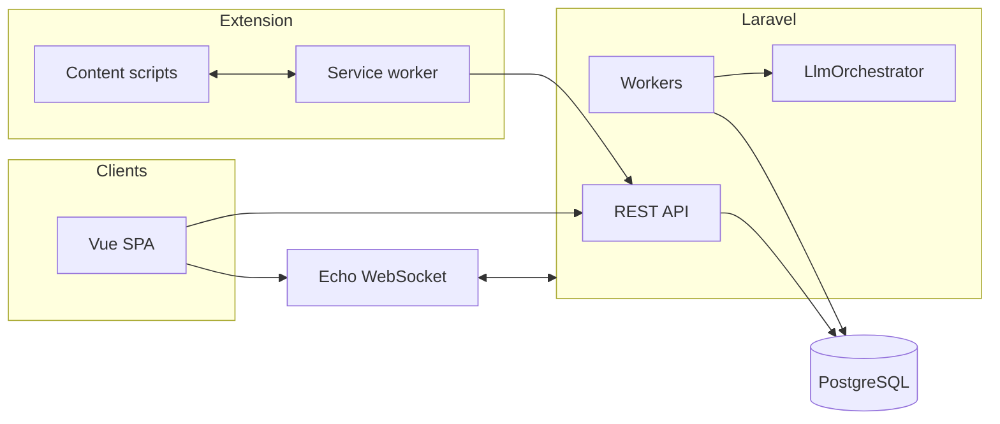

# Complete Technical Specification — Facebook Marketplace Auto-Responder

**Version**: 1.0 (compiled)  
**Audience**: Development team  
**Terminology (canonical)**: **Seller** = paying user / org member; **Buyer** = Marketplace inquirer; **Property** = rental unit + KB; **Conversation** = monitored thread. (UI may still display “tenant” where it aids comprehension.)

---

## 1. Introduction & product vision

### 1.1 Problem and vision

Sellers managing **multiple properties** in Quebec spend disproportionate time on **repetitive buyer messages** on Facebook Marketplace. The product **automates routine screening and scheduling dialogue** while **flagging** edge cases for **human review**, supporting **French and English** and **per-property** configuration.

### 1.2 System components

| Component | Role |
|-----------|------|
| Browser extension (MV3) | DOM capture, outbound send, pause, pairing |
| Laravel API | Auth, tenancy, persistence, queues, LLM orchestration |
| Vue dashboard | Configuration, review queue, analytics |
| LLM API (server-side) | Structured JSON conversation turns |
| Redis | Queue + cache + optional live counters |
| PostgreSQL | System of record |

### 1.3 MVP boundaries

**In MVP**: Extension ingest/outbox, KB, LLM pipeline with states and scoring, review queue, core analytics, bilingual behavior.  
**Phase 1.1**: Google Drive/Calendar depth.  
**Out of scope**: Photo/vision, unsupervised price negotiation.

*Source*: `artifacts/product-requirements.md`.

---

## 2. Conversation system design

### 2.1 Goals

- Same-primary-language-as-buyer (FR Québec / EN).  
- Facts only from **listing text** + **property KB** JSON.  
- Structured assistant output validated server-side.

### 2.2 States (summary)

`INITIAL`, `AVAILABILITY_CHECK`, `SCREENING`, `PROPERTY_DETAILS`, `VISIT_SCHEDULING`, `REDIRECTING`, `FLAGGED`, `REJECTED`, `COMPLETED` — transitions driven by intents, scores, and escalation (see source diagram in `artifacts/conversation-system-design.md`).

### 2.3 Assistant output contract (conceptual)

JSON fields include: `assistant_message_fr` / `assistant_message_en`, `active_language`, `detected_intents`, `proposed_next_state`, `screening_updates`, `score_deltas`, `escalation` (`none` | `review` | `block_auto_send`), optional `template_suggestion_id`.

### 2.4 Screening

Weighted criteria (credit self-report, TAL, pets, smoking, move-in alignment, stability signals) compose an **aggregate 0–100** score compared to seller thresholds: `auto_send_min`, `flag_below`, `release_visit_credentials_min`.

### 2.5 Safety guardrails

Scam/fraud, prompt injection, PII mishandling, discrimination-sensitive refusals, harassment, legal overreach, premature credentials — each maps to **escalation** and/or **block auto-send**. **Flag, do not silently drop.**

*Source*: `artifacts/conversation-system-design.md`.

---

## 3. System architecture



- **Multi-tenancy**: `organization_id` on tenant-owned rows; policies + global scopes.  
- **Auth**: Sanctum session/cookie for dashboard; **Bearer PAT** for extension (abilities).  
- **Queues**: Redis; dedicated `llm` queue optional.

*Source*: `artifacts/system-architecture.md`.

---

## 4. Browser extension

### 4.1 Manifest

Manifest **V3**; content scripts on `facebook.com` **Marketplace** and **Messenger** paths; service worker module; host permission for API origin.

### 4.2 Runtime architecture

- **SelectorRegistry** (versioned) abstracts DOM.  
- **MutationObserver** + debounce + optional `alarms` fallback polling.  
- **Service worker** performs HTTPS calls; content script never holds API keys.

### 4.3 Primary API operations

| Operation | Endpoint pattern |
|-----------|------------------|
| Ingest inbound | `POST /api/v1/threads/ingest` + `Idempotency-Key` |
| Poll outbound | `GET /api/v1/extension/outbox?since=...` |
| Delivery result | `POST /api/v1/messages/{id}/delivery-result` |
| Pause / resume | `POST /api/v1/extension/mode` |
| Resolve listing | `POST /api/v1/extension/resolve-listing` |

### 4.4 Popup (ASCII excerpt)

```
+----------------------------------------------------------+
|  FMAR                                     [ options ]     |
|  ● Connected    Mode: [*] Auto-respond                  |
|  Today: Auto-sent: 23   Flagged: 3                       |
|  [ Pause ]  [ Open dashboard ]  [ Review queue ]         |
+----------------------------------------------------------+
```

*Source*: `artifacts/browser-extension-spec.md`.

---

## 5. Backend API

### 5.1 Core entities

Organizations, users, sellers, extension devices, properties, listings (`marketplace_url`), conversations (`thread_key`), messages, review tasks, screening snapshots, message templates, OAuth connections, analytics events, daily rollups.

### 5.2 Processing pipeline

1. **Ingest** persists message, enqueues `ProcessIncomingMessage`.  
2. Worker loads KB, conversation state, thresholds → **LlmOrchestrator**.  
3. Valid JSON outcome → auto-send path **or** `review_task` + broadcast.  
4. Outbound rows exposed to extension via **outbox**; delivery results logged.

### 5.3 Integrations

Google OAuth (Drive/Calendar), encrypted refresh tokens; LLM client with retries, token accounting, circuit breaker.

*Source*: `artifacts/backend-api-spec.md`.

---

## 6. UX/UI design

### 6.1 Information architecture

Top-level: **Home**, **Properties**, **Conversations**, **Review queue**, **Screening**, **Analytics**, **Settings**.

### 6.2 Conversation detail (ASCII excerpt)

```
+--------------------------------------------------------------------------------+
| THREAD                              | CONTEXT                                |
| [buyer] Dispo juillet?              | Property: Chabot — $1200 — Jul 1       |
| [auto]  Oui, quelle date...         | Score: 78/100   State: SCREENING       |
| [draft] (pending review)            | [ Approve & send ] [ Edit ]            |
+--------------------------------------------------------------------------------+
```

### 6.3 Flows

Onboarding: sign up → property + KB → link listing URL → pair extension → first ingest.  
Daily: check flagged count → review queue → optional analytics.

*Source*: `artifacts/ux-ui-design.md` (full ASCII in source artifact).

---

## 7. Frontend application (Vue 3)

### 7.1 Structure

Vite + Vue 3 + Pinia + Vue Router + Tailwind + Axios + Vue I18n + Laravel Echo.

### 7.2 Stores (indicative)

`authStore`, `propertiesStore`, `conversationsStore`, `reviewQueueStore`, `analyticsStore`, `uiStore`.

### 7.3 Real-time

Subscribe to `private-tenant.{organizationId}`; handle `ReviewTaskCreated`, `MessageIngested`, `ScreeningUpdated`.

*Source*: `artifacts/frontend-spec.md`.

---

## 8. Analytics system

- **Events** append-only into `analytics_events` (90-day raw retention per policy).  
- **Rollups** `analytics_rollups_daily` (2-year); optional hourly buckets.  
- **Redis** same-day counters for overview cards.  
- **KPIs**: median first response, auto-send rate, flag rate, screening average, funnel stages, per-property volume.

*Source*: `artifacts/analytics-spec.md`.

---

## 9. Risk assessment & mitigation (summary)

| Risk | Mitigation summary |
|------|--------------------|
| Meta ToS / enforcement | Legal review, disclosure, conservative automation, pause, human review |
| DOM breakage | SelectorRegistry, telemetry, rapid releases |
| Tenant isolation bug | Policies, scopes, tests, pen test |
| Prompt injection | Schema validation, separate prompt roles, monitoring |
| Law 25 | DPIA, minimization, retention, DSR, DPAs with AI vendor |
| Hallucinated facts | KB-only rule, review queue, thresholds |

*Detail*: `artifacts/orchestration-analysis-report/risk-assessment.md`.

---

## 10. Implementation roadmap

### Phase A — Foundation (weeks 1–3)

- Laravel app + Sanctum + org/user models  
- Property + listing CRUD + KB JSON  
- Vue shell + auth + Properties pages  

**Team**: 1 backend, 1 frontend

### Phase B — Extension + pipeline (weeks 3–6)

- MV3 extension ingest + outbox + pairing token  
- `ProcessIncomingMessage` + `LlmOrchestrator` stub → real provider  
- Basic conversation list in dashboard  

**Team**: +1 extension engineer (or full-stack)

### Phase C — Review + reliability (weeks 6–8)

- Review queue UI + approve/edit/send  
- Screening snapshots + thresholds  
- Echo events + Redis counters  

### Phase D — Analytics + hardening (weeks 8–10)

- Rollup jobs + overview/timeseries endpoints  
- Rate limits, audit logs, redaction  
- Pilot feedback loop  

### Phase E — v1.1 integrations

- Google OAuth hardening, Calendar freebusy, Drive links

### Suggested team composition

| Phase | Roles |
|-------|--------|
| A–B | 1–2 backend, 1 frontend, 0.5 extension |
| C–D | +QA, +part-time DevOps |
| E | Backend + integration focus |

---

## 11. Appendices

### 11.1 Glossary

| Term | Definition |
|------|------------|
| Seller | Customer using the product (property manager); maps to “landlord” in domain language |
| Buyer | Person messaging on Marketplace; maps to “tenant” prospect |
| Property | Rental unit record including KB, visit rules, contacts |
| Conversation | Monitored Marketplace thread mapped to listing/property |
| TAL | Tribunal administratif du logement (Quebec rental board) |
| KB | Knowledge base JSON injected into prompts |
| PAT | Personal access token for extension |
| Outbox | Pending outbound messages for extension polling |

### 11.2 Source artifact index

| Topic | Path |
|-------|------|
| Requirements | `artifacts/requirements.md` |
| Product | `artifacts/product-requirements.md` |
| Conversation AI | `artifacts/conversation-system-design.md` |
| Architecture | `artifacts/system-architecture.md` |
| Extension | `artifacts/browser-extension-spec.md` |
| Backend | `artifacts/backend-api-spec.md` |
| UX | `artifacts/ux-ui-design.md` |
| Frontend | `artifacts/frontend-spec.md` |
| Analytics | `artifacts/analytics-spec.md` |
| Analysis | `artifacts/orchestration-analysis-report/*.md` |

### 11.3 Analyst “must fix” tracking

| Item | Status in this specification |
|------|-------------------------------|
| Legal sign-off | Called out in §9–10 (process) |
| OpenAPI / JSON schemas | Called out in §10 Phase A–B deliverable |
| DB idempotency constraints | Referenced in §5; implement in migrations |

---

*End of compiled specification. For exhaustive diagrams and tables, use the source artifacts listed in §11.2.*
