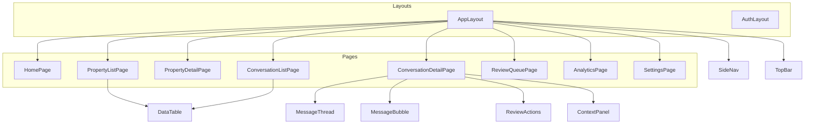

# Frontend Specification — Facebook Marketplace Auto-Responder

**Version**: 1.0  
**Inputs**: `artifacts/ux-ui-design.md`, `artifacts/backend-api-spec.md`, `artifacts/system-architecture.md`  
**Stack**: Vue 3.4+ (`<script setup>`), Vite 5, Pinia 2, Vue Router 4, Tailwind 3, Axios, Laravel Echo + Soketi/Pusher, Vue I18n 9

---

## 1. Project Structure & File Organization

```
frontend/
├── index.html
├── vite.config.ts
├── package.json
├── src/
│   ├── main.ts
│   ├── App.vue
│   ├── assets/
│   ├── components/
│   │   ├── common/
│   │   │   ├── DataTable.vue
│   │   │   ├── StatusBadge.vue
│   │   │   ├── ScoreIndicator.vue
│   │   │   ├── KpiCard.vue
│   │   │   └── ConfirmDialog.vue
│   │   ├── layout/
│   │   │   ├── AppShell.vue
│   │   │   ├── SideNav.vue
│   │   │   └── TopBar.vue
│   │   ├── conversations/
│   │   │   ├── MessageThread.vue
│   │   │   ├── MessageBubble.vue
│   │   │   ├── ReviewActions.vue
│   │   │   └── ContextPanel.vue
│   │   └── properties/
│   │       ├── PropertyForm.vue
│   │       └── ListingLinker.vue
│   ├── composables/
│   │   ├── useEcho.ts
│   │   ├── usePaginatedResource.ts
│   │   └── useReviewKeyboard.ts
│   ├── layouts/
│   │   ├── AppLayout.vue
│   │   └── AuthLayout.vue
│   ├── pages/
│   │   ├── home/HomePage.vue
│   │   ├── properties/
│   │   │   ├── PropertyListPage.vue
│   │   │   └── PropertyDetailPage.vue
│   │   ├── conversations/
│   │   │   ├── ConversationListPage.vue
│   │   │   └── ConversationDetailPage.vue
│   │   ├── review/ReviewQueuePage.vue
│   │   ├── screening/ScreeningDetailPage.vue
│   │   ├── analytics/AnalyticsPage.vue
│   │   └── settings/SettingsPage.vue
│   ├── router/
│   │   └── index.ts
│   ├── services/
│   │   ├── http.ts
│   │   ├── authService.ts
│   │   ├── propertyService.ts
│   │   ├── listingService.ts
│   │   ├── conversationService.ts
│   │   ├── reviewService.ts
│   │   ├── analyticsService.ts
│   │   └── settingsService.ts
│   ├── stores/
│   │   ├── authStore.ts
│   │   ├── propertiesStore.ts
│   │   ├── conversationsStore.ts
│   │   ├── reviewQueueStore.ts
│   │   ├── analyticsStore.ts
│   │   └── uiStore.ts
│   ├── i18n/
│   │   ├── index.ts
│   │   └── locales/
│   │       ├── en.json
│   │       └── fr-CA.json
│   └── types/
│       └── api.ts
└── tests/
    └── unit/...
```

---

## 2. Component Architecture



| Component | Props | Emits | Notes |
|-----------|-------|-------|--------|
| `MessageBubble` | `message`, `variant` auto/human | — | Sanitized text; `dir` for FR |
| `ReviewActions` | `taskId`, `draftText` | `approved`, `rejected` | Validates non-empty |
| `ContextPanel` | `property`, `listing`, `screening` | `insertTemplate` | Collapsible sections |
| `DataTable` | `columns`, `rows`, `loading` | `sort`, `rowClick` | Slot for actions |

---

## 3. State Management (Pinia)

### 3.1 `useAuthStore`

- **State**: `user`, `organization`, `status`  
- **Getters**: `isAuthenticated`  
- **Actions**: `login`, `logout`, `fetchSession`

### 3.2 `usePropertiesStore`

- **State**: `items`, `currentProperty`, `loading`  
- **Actions**: `fetchList`, `fetchOne`, `saveKb`, `patchProperty`

### 3.3 `useConversationsStore`

- **State**: `list`, `activeId`, `messagesByConversation`, `filters`  
- **Getters**: `activeConversation`, `flaggedCount` (from list or API)  
- **Actions**: `fetchList`, `fetchMessages`, `applyFilters`, `patchConversation`  
- **Realtime**: on `ScreeningUpdated`, patch row in `list`

### 3.4 `useReviewQueueStore`

- **State**: `tasks`, `cursor`, `loading`  
- **Actions**: `fetchOpen`, `approve`, `reject`  
- **Optimistic**: remove task on approve; rollback on error

### 3.5 `useAnalyticsStore`

- **State**: `overview`, `timeseries`, `range`  
- **Actions**: `loadOverview`, `loadTimeseries`

### 3.6 `useUiStore`

- **State**: `locale`, `sidebarCollapsed`, `toasts`  
- **Actions**: `pushToast`, `setLocale` (persist + `i18n.global.locale`)

**Caching**: Conversations list TTL 60s; detail/messages no TTL but invalidate on Echo events for that `conversationId`.

---

## 4. Routing Configuration

| Path | Component | Meta |
|------|-----------|------|
| `/login` | `LoginPage` | `guest: true` |
| `/` | `HomePage` | `auth: true` |
| `/properties` | `PropertyListPage` | `auth: true` |
| `/properties/:id` | `PropertyDetailPage` | `auth: true` |
| `/conversations` | `ConversationListPage` | `auth: true` |
| `/conversations/:id` | `ConversationDetailPage` | `auth: true` |
| `/review-queue` | `ReviewQueuePage` | `auth: true` |
| `/screening/:conversationId` | `ScreeningDetailPage` | `auth: true` |
| `/analytics` | `AnalyticsPage` | `auth: true` |
| `/settings` | `SettingsPage` | `auth: true` |

**Guards**: `beforeEach` — if `meta.auth` and no session, redirect `/login`. Fetch session once on app init.

**Lazy loading**: `() => import('@/pages/...')` for all pages except `LoginPage`.

---

## 5. API Integration Layer

### 5.1 `http.ts` (Axios)

```typescript
// Sketch — implementation matches backend-api-spec paths
import axios from 'axios'

export const http = axios.create({
  baseURL: import.meta.env.VITE_API_URL + '/api/v1',
  withCredentials: true,
  headers: { Accept: 'application/json' },
})

http.interceptors.response.use(
  (r) => r,
  (err) => {
    if (err.response?.status === 401) {
      // redirect login unless on public route
    }
    return Promise.reject(err)
  }
)
```

### 5.2 Service modules

- Mirror REST groups: `propertyService.list()`, `conversationService.messages(id, cursor)`, `reviewService.approve(id, body)`, `analyticsService.overview(params)`.  
- **Types**: `types/api.ts` generated manually or via OpenAPI later.

---

## 6. Real-Time Updates (WebSocket)

### 6.1 `useEcho.ts`

- Initialize Echo with `VITE_PUSHER_KEY`, `wsHost`, `authEndpoint` `/broadcasting/auth` (Sanctum).  
- **Subscribe**: `private-tenant.{organizationId}` on session load.

### 6.2 Events → stores

| Event | Store action |
|-------|----------------|
| `ReviewTaskCreated` | `reviewQueueStore.prepend` / toast + nav badge |
| `MessageIngested` | refresh conversation row / message list if active |
| `ScreeningUpdated` | patch `conversationsStore.list` item |
| `OutboundSent` | analytics counters optional refresh |

**Reconnection**: Echo default; show banner when disconnected.

---

## 7. Conversation Review Interface

- **`ConversationDetailPage`**: two-column `lg:grid-cols-[1fr_360px]`; stack on `<lg` with tabs.  
- **`ReviewActions`**: `textarea` bound to `draftText`; `Approve & send` → `reviewService.send`.  
- **`useReviewKeyboard`**: registers shortcuts when route matches and no input focused (check `document.activeElement`).  
- **Property context**: `ContextPanel` fetches property if not embedded in conversation payload.

---

## 8. Responsive Design Implementation

- Tailwind breakpoints: `sm` 640, `md` 768, `lg` 1024, `xl` 1280.  
- **SideNav**: `lg:static` drawer; hamburger below `lg`.  
- **DataTable**: horizontal scroll + `md:hidden` card row alternative optional phase 2.

---

## 9. Internationalization (Vue I18n)

```typescript
// src/i18n/index.ts (sketch)
import { createI18n } from 'vue-i18n'
import en from './locales/en.json'
import fr from './locales/fr-CA.json'

export const i18n = createI18n({
  legacy: false,
  locale: localStorage.getItem('locale') ?? 'en',
  fallbackLocale: 'en',
  messages: { en, 'fr-CA': fr },
})
```

- **Formatting**: `d()` for dates with user/org timezone via custom composable wrapping `Intl.DateTimeFormat`.  
- **Extension**: same locale keys exported for future shared package (optional).

---

## 10. Build & Deployment Configuration

- **Env**: `VITE_API_URL`, `VITE_WS_HOST`, `VITE_PUSHER_KEY`, `VITE_PUSHER_CLUSTER` or custom.  
- **Build**: `npm run build` → static assets to `public/` or CDN; served separately from Laravel or via `vite` in dev with proxy to `http://localhost:8000`.  
- **CORS / cookies**: align `SANCTUM_STATEFUL_DOMAINS` with Vite dev origin.

---

## 11. Testing Strategy

| Layer | Tooling |
|-------|---------|
| Unit | Vitest + Vue Test Utils — stores, composables, presentational components |
| Contract | Optional Pact later against OpenAPI |
| E2E | Playwright — login, review approve flow (staging) |

---

## Definition of Done (Frontend Engineer)

- [x] Folder structure and page map match `ux-ui-design.md`.  
- [x] Component hierarchy diagram + key props.  
- [x] Pinia stores and routing with auth meta.  
- [x] Axios layer + Echo event mapping.  
- [x] Review UI, responsive, i18n, build/test strategy.  
- [x] Services align with `backend-api-spec.md` endpoint groups.
