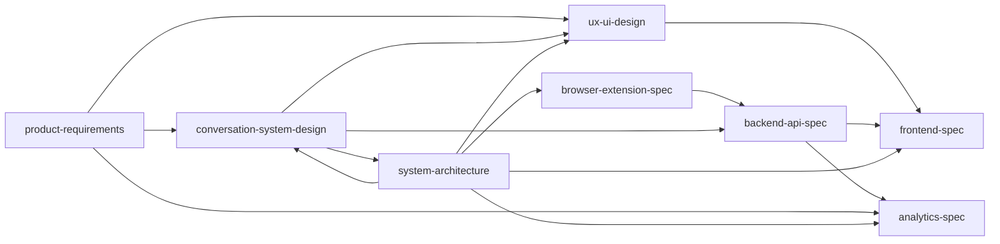

# Status Dashboard — Facebook Marketplace Auto-Responder Orchestration

**Last updated**: 2026-03-31

---

## Persona Completion Status

| Step | Persona | Deliverable | Status | Notes |
|------|---------|-------------|--------|-------|
| 1 | Product Strategist | `artifacts/product-requirements.md` | **Complete** | MVP, MoSCoW, journeys |
| 2 | LLM Prompt Engineer | `artifacts/conversation-system-design.md` | **Complete** | States, prompts, scoring, safety |
| 3 | System Architect | `artifacts/system-architecture.md` | **Complete** | Stack, diagrams, tenancy |
| 4 | Browser Extension Engineer | `artifacts/browser-extension-spec.md` | **Complete** | MV3, ingest/outbox |
| 5 | Backend Engineer | `artifacts/backend-api-spec.md` | **Complete** | ERD, endpoints, jobs |
| 6 | UX/UI Designer | `artifacts/ux-ui-design.md` | **Complete** | ASCII wireframes, flows |
| 7 | Frontend Engineer | `artifacts/frontend-spec.md` | **Complete** | Pinia, routes, Echo |
| 8 | Analytics Engineer | `artifacts/analytics-spec.md` | **Complete** | KPIs, rollups, APIs |
| 9 | Orchestrator | `project-summary.md`, `status-dashboard.md` | **Complete** | This pass |
| 10 | Analyst | `gap-analysis.md`, `risk-assessment.md`, `quality-metrics.md` | **Complete** | Same pass |
| 11 | Compiler | `final-product/*` | **Complete** | Same pass |

---

## Deliverable Tracking (Artifact Checklist)

| Artifact path | Present |
|---------------|---------|
| `artifacts/requirements.md` | Yes |
| `artifacts/orchestration-definition.md` | Yes |
| `artifacts/organization-schema.md` | Yes |
| `artifacts/product-requirements.md` | Yes |
| `artifacts/conversation-system-design.md` | Yes |
| `artifacts/system-architecture.md` | Yes |
| `artifacts/browser-extension-spec.md` | Yes |
| `artifacts/backend-api-spec.md` | Yes |
| `artifacts/ux-ui-design.md` | Yes |
| `artifacts/frontend-spec.md` | Yes |
| `artifacts/analytics-spec.md` | Yes |
| `artifacts/orchestration-analysis-report/project-summary.md` | Yes |
| `artifacts/orchestration-analysis-report/status-dashboard.md` | Yes |
| `artifacts/orchestration-analysis-report/gap-analysis.md` | Yes |
| `artifacts/orchestration-analysis-report/risk-assessment.md` | Yes |
| `artifacts/orchestration-analysis-report/quality-metrics.md` | Yes |
| `artifacts/final-product/README.md` | Yes |
| `artifacts/final-product/executive-summary.md` | Yes |
| `artifacts/final-product/complete-technical-specification.md` | Yes |

---

## Dependency Resolution Status

| Dependency | Resolution |
|------------|------------|
| Extension API → Backend | Aligned on `/api/v1/threads/ingest`, outbox, delivery-result, mode |
| Frontend routes → UX IA | Matched |
| Analytics events → Backend | Listener mapping defined in analytics spec |
| Architecture sequence “POST /threads/{id}/messages” vs extension “ingest” | **Unified model**: extension uses **ingest**; dashboard may use conversation message APIs — implementation treats ingest as primary extension contract |

---

## Overall Orchestration Health Score

**8.5 / 10**

**Rationale**: All persona artifacts exist and cross-reference coherently. Deductions for: (1) Meta policy residual risk, (2) some API bodies still narrative not OpenAPI, (3) extension real-time path is polling-first.

---

## Recommendations for Next Steps

1. **Legal / product**: Sign off on automation risk disclosure and conservative default (delays, review-heavy mode).  
2. **Engineering**: Generate **OpenAPI 3** from Laravel or hand-authored stub; generate TypeScript types for frontend.  
3. **Extension**: Build SelectorRegistry with on-device “health” telemetry (non-PII).  
4. **Privacy**: Data retention job + Law 25 checklist before production.  
5. **MVP build order**: Auth + properties/listings → ingest API + worker + LLM → outbox send → review UI → analytics rollups → Echo.
