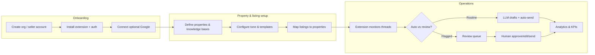
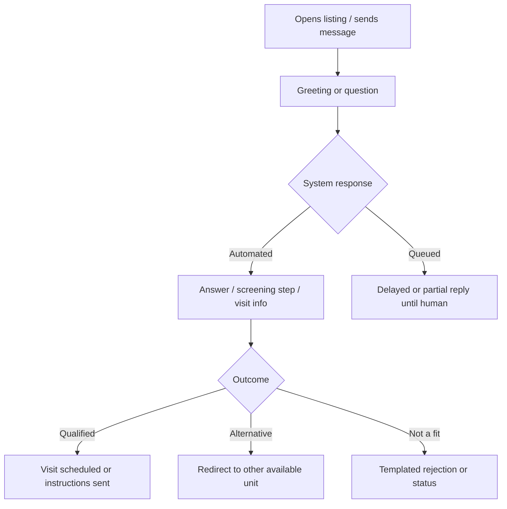

# Product Requirements — Facebook Marketplace Auto-Responder

**Version**: 1.0  
**Inputs**: `artifacts/requirements.md`, `artifacts/orchestration-definition.md`  
**Audience**: Product, engineering, and subsequent orchestration personas

---

## Product Vision & Problem Statement

### Problem

Landlords in Greater Montreal (Montreal, Longueuil) who list rental units on Facebook Marketplace face a high volume of repetitive tenant inquiries: availability dates, credit and TAL (Tribunal administratif du logement) expectations, pets and smoking policies, appliances and layout, visit logistics (lockboxes vs. contact persons), and follow-ups when a unit is rented. The same questions recur across many listings and named property portfolios (e.g. Chabot, Gardenville, Cartier, Quinn, 6e Ave, Marmier, Adelaide). Answering manually does not scale and delays responses, which hurts conversion and increases operational load.

### Vision

A multi-tenant system that combines a **Chrome/Firefox browser extension** (Marketplace message capture and send) with a **Laravel + Vue web dashboard** (configuration, review queue, analytics). An **LLM** handles full conversational flows in **French and English**, grounded in **per-listing text context** (title, description, price — no image understanding). **Routine** messages are auto-sent; **unusual, sensitive, or suspicious** messages are **queued for human review** without blocking the conversation thread. Tone is **configurable per seller**. Optional **Google Drive** (photo links/albums) and **Google Calendar** (visits, double-booking awareness) extend the core experience.

### Success Theme

Landlords spend less time on repetitive screening while maintaining quality, compliance-minded interactions and clear escalation when automation should not decide alone.

---

## Target Users & Market Context

| Segment | Description | Primary needs |
|--------|-------------|----------------|
| **Primary — Portfolio landlord** | Manages multiple properties and listings; Quebec market; FR-first conversations | Multi-listing monitoring, per-property facts, visit coordination, screening consistency |
| **Secondary — Operations / assistant** | May configure properties or clear review queues on behalf of the landlord | Role-based access (future), audit-friendly review UI |
| **Tenant (buyer)** | Marketplace user messaging about rentals | Fast, clear answers; respectful tone; path to visits and next steps |

**Constraints from requirements**: Browser extension + web app; Laravel backend, Vue frontend; multi-tenant; no photo analysis for LLM context — text listing fields only.

---

## User Journey Maps

### Landlord journey

**Pain points addressed**: Repetition (automation), inconsistency (templates + KB), overload (review queue), multi-property confusion (per-listing KB and redirects when rented).

### Tenant journey

**Conversation patterns from domain** (referenced in stories below):

1. Greeting + availability date  
2. Credit check / TAL screening  
3. Animals / smoking  
4. Property details (appliances, furnishing, dimensions)  
5. Visit scheduling (lockbox, contacts, phone)  
6. Redirect when unit rented  
7. Follow-ups (rejection, status updates)

---

## User Stories with Acceptance Criteria

### Multi-tenant & access

- **US-1**: As a landlord, I want to manage multiple seller accounts or organizations so that my team and I can separate brands or owners.  
  - **AC**: Distinct tenant data isolation; authenticated dashboard; extension associates sessions with the correct tenant/seller.

### Browser extension

- **US-2**: As a landlord, I want the extension to work on Facebook Marketplace in Chrome and Firefox so I am not locked to one browser.  
  - **AC**: Manifest v3 (Chrome) and compatible Firefox packaging; documented limitations if Meta UI changes.

- **US-3**: As a landlord, I want incoming and outgoing messages on monitored threads to sync to the backend so the LLM has conversation context.  
  - **AC**: Messages captured with listing/thread identifiers; failures retried or surfaced; no silent loss of user-typed sends where detectable.

### Configuration & knowledge base

- **US-4**: As a landlord, I want a per-property (per-listing) knowledge base so answers match address, price, availability, policies, and visit rules.  
  - **AC**: Structured fields + free text; extension or backend resolves “this thread ↔ this listing ↔ this KB”.

- **US-5**: As a landlord, I want configurable tone per seller so automated messages sound like me or my brand.  
  - **AC**: Tone presets or sliders + preview; applied in LLM system/developer instructions.

### Conversation automation (patterns 1–7)

- **US-6**: As a landlord, I want the system to answer availability and basic property questions automatically when safe.  
  - **AC**: Uses KB + listing text; bilingual FR/EN; falls back to review when confidence or policy triggers fire.

- **US-7**: As a landlord, I want credit/TAL and pet/smoking screening without repeating questions unnecessarily.  
  - **AC**: Per-buyer conversation state; idempotent follow-ups; scoring inputs feed flags (see US-10).

- **US-8**: As a landlord, I want visit coordination that respects lockbox vs. contact-person properties.  
  - **AC**: Correct template branch; optional calendar integration for proposed slots; contact name + phone surfaced from KB.

- **US-9**: As a landlord, when a unit is rented I want prospects directed to similar available units.  
  - **AC**: Rule or LLM-guided redirect using inventory flags; human review option for edge cases.

### Human-in-the-loop & safety

- **US-10**: As a landlord, I want unusual or sensitive messages in a review queue, and scams/inappropriate content flagged but not silently dropped.  
  - **AC**: Queue UI; reasons/tags; approve/edit/send; audit trail; “flag but don’t block” for suspicious content.

### Integrations

- **US-11**: As a landlord, I want to share Drive links or albums for photos when relevant.  
  - **AC**: Stored per property; LLM or template can inject when appropriate; permissions documented.

- **US-12**: As a landlord, I want Google Calendar awareness for visits to reduce double-booking.  
  - **AC**: OAuth; create/update events or busy checks per configuration; failures degrade gracefully.

### Analytics

- **US-13**: As a landlord, I want analytics on volumes, response times, trends, and conversion so I can tune listings and automation.  
  - **AC**: Dashboard charts/tables; definitions aligned with backend events; export optional (phaseable).

---

## Feature Backlog (Prioritized — MoSCoW)

MoSCoW applies to **first commercial release (MVP)** unless noted.

| ID | Feature | Component | Priority | Complexity | MVP |
|----|---------|-----------|----------|------------|-----|
| F-01 | Auth & multi-tenant org/seller model | Backend + Dashboard | Must | L | Yes |
| F-02 | Extension: thread/listing detection + message capture/send | Extension + API | Must | XL | Yes |
| F-03 | Per-listing/property knowledge base CRUD | Dashboard + API | Must | L | Yes |
| F-04 | LLM orchestration: prompts, state, bilingual FR/EN | Backend + LLM | Must | XL | Yes |
| F-05 | Auto-send routine replies; queue non-routine | Backend + Dashboard | Must | L | Yes |
| F-06 | Conversation state per buyer/thread | Backend | Must | M | Yes |
| F-07 | Tenant screening scoring + flags | Backend + LLM | Must | L | Yes |
| F-08 | Templated rejection/status/follow-up messages | Dashboard + LLM | Must | M | Yes |
| F-09 | Visit flows: lockbox vs. contact person | KB + LLM | Must | M | Yes |
| F-10 | Rented-unit redirect to alternatives | KB + LLM | Should | M | Yes |
| F-11 | Google Drive link/album per property | Dashboard + API + LLM | Should | M | Phase 1.1 |
| F-12 | Google Calendar visit scheduling / busy check | Backend + Dashboard | Should | L | Phase 1.1 |
| F-13 | Full analytics dashboard (metrics, trends, conversion, response time) | Dashboard + API | Should | L | Yes (core metrics); Could (advanced) |
| F-14 | Negotiation-style price discussions | LLM | Could | M | No — policy-heavy; review-first |
| F-15 | Photo / vision understanding | — | Won’t | — | No (explicit non-goal) |

**Dependency notes**: F-02 blocks F-04/F-05; F-03 blocks accurate F-04; F-06 unlocks F-07 without repetition; F-11/F-12 depend on OAuth and compliance review.

---

## MVP Definition & Boundaries

### In scope (MVP / v1.0)

- Browser extension (Chrome + Firefox) with authenticated backend sync for Marketplace threads tied to listings.  
- Dashboard: properties/listings, KB fields, tone settings, templates, review queue, basic user management per tenant.  
- LLM-driven replies covering domain patterns 1–7 with **bilingual** support and **per-listing** context.  
- **Human review queue** for sensitive/unusual/scam-flagged messages; **auto-send** for approved routine paths.  
- **Conversation state** and **screening scoring** with configurable thresholds for flags.  
- **Core analytics**: conversation volume, automated vs. human-handled ratio, response time, simple conversion funnel (e.g. inquiry → visit proposed → agreed).  

### Phase 1.1 (immediately after MVP)

- Google Drive link injection polished end-to-end.  
- Google Calendar: visit proposals with conflict awareness.

### Out of scope (explicit)

- Computer vision / photo analysis for listing or chat images.  
- Guaranteed compliance with Meta ToS — product must surface **risk** and configurable conservative modes (Analyst/Orchestrator tracks policy risk).  
- Fully autonomous price negotiation without review (Could / later).

---

## Success Metrics & KPIs

| KPI | Definition | Target direction |
|-----|------------|------------------|
| Landlord time saved | Estimated minutes per conversation × automated share | Increase |
| Median first response time | Time from tenant message to first outbound reply | Decrease |
| Auto-resolution rate | Threads resolved without human message after automation on | Increase (with quality guardrails) |
| Review queue SLA | Time until human handles flagged thread | Decrease |
| Visit show rate / booking conversion | Visits scheduled or completed / qualified leads | Increase |
| Flag precision | Useful flags / total flags (human judgment sample) | Increase |
| Tenant satisfaction proxy | Optional short feedback or reply-rate | Neutral or positive |

---

## Assumptions & Constraints

1. **Facebook surface stability**: DOM and Messenger/Marketplace integration may change; extension requires maintenance releases.  
2. **Text-only LLM context**: Rich media in chat is not interpreted as listing truth — only configured text and KB.  
3. **Legal**: Quebec rental advertising and screening practices evolve; product provides configuration and logging, not legal advice.  
4. **Bilingual**: UI may be EN-first for dashboard while conversations are FR-primary; LLM must handle code-switching common in Montreal.  
5. **Multi-property names** (Chabot, Gardenville, etc.) are examples of portfolio scale — product supports arbitrary property sets.  
6. **Security**: Multi-tenant isolation is a hard requirement for all APIs and extension tokens.

---

## Traceability — Scoping decisions (requirements Q&A)

| # | Decision | Covered in |
|---|----------|------------|
| 1 | Bilingual FR/EN | Vision, US-6, F-04 |
| 2 | Per-property knowledge base | US-4, F-03 |
| 3 | Auto-redirect when rented | US-9, F-10 |
| 4 | Contact persons per property | US-8, F-09 |
| 5 | Conversation state | US-7, F-06 |
| 6 | Lockbox / self-visit | US-8, F-09 |
| 7 | Tenant screening scoring | US-7, F-07 |
| 8 | Templated rejection/status | US-8, F-08 |
| 9 | Google Drive | US-11, F-11 |
| 10 | Google Calendar | US-12, F-12 |

---

## Definition of Done (Product Strategist)

- [x] `artifacts/requirements.md` read; all 10 scoping decisions traced.  
- [x] `artifacts/product-requirements.md` created.  
- [x] Vision, problem, users, journeys (landlord + tenant), stories with AC, MoSCoW backlog, MVP boundaries, KPIs, assumptions.  
- [x] Domain conversation patterns 1–7 referenced and mapped to features.
