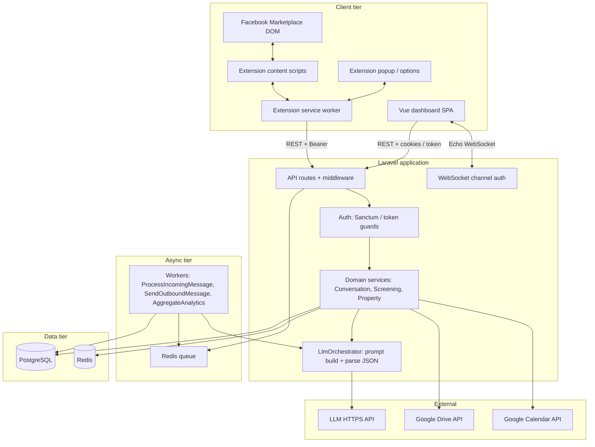
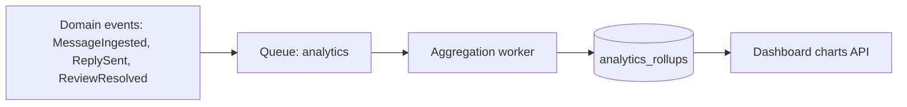
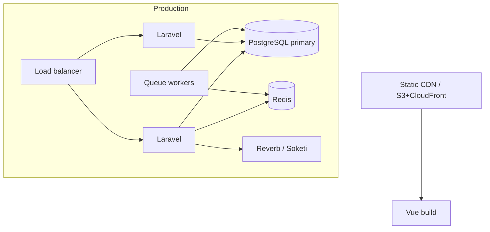

# System Architecture — Facebook Marketplace Auto-Responder

**Version**: 1.0  
**Inputs**: `artifacts/product-requirements.md`, `artifacts/conversation-system-design.md`  
**Consumers**: Browser Extension Engineer, Backend Engineer, UX/UI Designer, Frontend Engineer, Analytics Engineer

---

## 1. Technology Stack Overview

| Layer | Technology | Notes |
|-------|------------|--------|
| Backend | Laravel 11+, PHP 8.2+ | HTTP API, auth, queues, events, Sanctum/Passport for tokens |
| Primary DB | PostgreSQL 15+ (preferred) or MySQL 8+ | JSON columns for KB snapshots; indexes for thread/tenant queries |
| Cache & queue broker | Redis 7+ | Cache, Laravel queue driver, rate-limit counters |
| Queue workers | Laravel Queue (Redis) | LLM calls, outbound message dispatch, analytics aggregation |
| Frontend | Vue 3 (Composition API), Vite, Pinia, Vue Router | SPA dashboard |
| Styling | Tailwind CSS | Align with UX spec |
| Real-time | Laravel Reverb or Soketi + Laravel Echo | WebSocket channels per tenant / conversation |
| Browser extension | Manifest V3; Chrome + Firefox targets | Service worker + content scripts |
| LLM | Provider-agnostic HTTPS API (e.g. OpenAI, Anthropic) | Single abstraction in `LlmClient` |
| Object storage (optional) | S3-compatible | Extension artifacts, exports — phaseable |
| External APIs | Google OAuth 2.0; Drive v3; Calendar v3 | Per-tenant stored refresh tokens (encrypted) |

### Decision notes

- **Laravel Queue + Redis** instead of RabbitMQ for MVP: ops simplicity, single broker for cache + queue, horizontal scale by adding workers.  
- **PostgreSQL**: robust JSONB for `property_kb` snapshots and LLM request metadata; easier constraint modeling for multi-tenant FKs.  
- **Reverb/Soketi**: self-hosted WebSockets avoid per-connection SaaS cost at scale; Pusher acceptable if ops prefers managed.

---

## 2. System Component Architecture



**Boundaries**

- **Extension** never holds LLM keys; uses short-lived **device/session tokens** scoped to `seller_id` / `organization_id`.  
- **LlmOrchestrator** is the only module assembling system prompts and validating structured JSON against schema from `conversation-system-design.md`.  
- **Conversation state** is persisted in PostgreSQL; Redis caches hot thread state with TTL and invalidation on write.

---

## 3. Data Flow Diagrams

### 3.1 Inbound message → LLM → outbound

```mermaid
sequenceDiagram
  participant FB as Marketplace UI
  participant CS as Content script
  participant API as Laravel API
  participant Q as Queue
  participant W as Worker
  participant LLM as LLM API

  FB->>CS: Mutation / poll detects new message
  CS->>API: POST /api/v1/threads/{id}/messages (ingest)
  API->>API: Persist + dedupe + attach listing/property
  API->>Q: ProcessIncomingMessage job
  API-->>CS: 202 Accepted
  Q->>W: job
  W->>W: Load KB, state, thresholds
  W->>LLM: Chat completion (structured output)
  LLM-->>W: JSON per conversation-system-design
  W->>W: Validate; set review vs auto-send
  alt auto-send allowed
    W->>API: Dispatch outbound send job
    W-->>CS: Push via WebSocket optional
  else review required
    W->>API: Create review task; notify dashboard
  end
```

### 3.2 Extension sends approved reply

```mermaid
sequenceDiagram
  participant CS as Content script
  participant API as Laravel API
  participant PG as PostgreSQL

  CS->>API: POST /api/v1/outbound/send (signed payload)
  API->>PG: Log attempt; idempotency key
  API-->>CS: Instruction + text + metadata
  CS->>CS: Inject into Marketplace composer / send
  CS->>API: POST outcome (sent / failed + error)
```

### 3.3 Real-time dashboard

```mermaid
sequenceDiagram
  participant VUE as Vue app
  participant Echo as Laravel Echo
  participant WS as Reverb/Soketi
  participant API as Laravel

  VUE->>API: Authenticate; obtain channel token
  VUE->>Echo: subscribe private-tenant.{id}
  WS-->>VUE: conversation.updated, review.created
```

### 3.4 Analytics pipeline



---

## 4. Multi-Tenant Architecture

| Concept | Implementation |
|---------|----------------|
| **Tenant root** | `organizations` (landlord / property management company). |
| **Seller** | `sellers` or `users` linked to org; Marketplace identity + extension pairing. |
| **Isolation** | **Application-level**: every query scoped by `organization_id` (and optional `seller_id`) via global scopes / policies. |
| **Future hardening** | PostgreSQL RLS optional for compliance; not required for MVP if scopes audited. |
| **Extension auth** | Per-device `personal_access_tokens` (Sanctum) or custom token table with `abilities`: `extension:sync`. |
| **Dashboard auth** | Session + CSRF for same-origin, or SPA token with refresh. |

**Data partitioning**: All conversation, property, template, and analytics child tables include `organization_id` NOT NULL + indexed.

---

## 5. API Contract Overview (categories)

REST base: `/api/v1/...`; JSON; `Accept-Language` respected for dashboard-only strings.

| Category | Example endpoints | Purpose |
|----------|-------------------|---------|
| Auth | `POST /auth/login`, `POST /auth/token` (extension) | Sessions / PAT issuance |
| Org & users | `GET/PATCH /organizations/current`, `GET /users` | Tenant admin |
| Properties & KB | `CRUD /properties`, `CRUD /listings`, `PATCH /properties/{id}/kb` | Knowledge base |
| Threads & messages | `GET /threads`, `GET /threads/{id}/messages`, `POST /threads/{id}/messages` | Ingest from extension; dashboard |
| Outbound | `POST /outbound/preview`, `POST /outbound/send` | Controlled send path |
| Review queue | `GET /reviews`, `PATCH /reviews/{id}` | Approve, edit, reject |
| LLM admin | `POST /prompts/preview` (internal) | Debug — optional, gated |
| Integrations | `GET /integrations/google`, OAuth callbacks | Drive/Calendar |
| Analytics | `GET /analytics/summary`, `GET /analytics/timeseries` | Dashboard |
| Webhooks | N/A for MVP Facebook | Future if Meta API available |

Full request/response schemas belong in `backend-api-spec.md`.

---

## 6. Integration Architecture

### 6.1 LLM API

- **Pattern**: Single `LlmOrchestrator` service: build messages array (system + developer + user), call provider, parse JSON, map to domain commands.  
- **Retries**: Idempotent jobs; exponential backoff; circuit breaker per org for cost control.  
- **Cost**: Log token usage per `organization_id` / thread; daily budget flag → force `review` escalation.  
- **Fallback**: On provider failure, enqueue human review + tenant-facing stall message template.

### 6.2 Google Drive

- OAuth per seller or org; store `refresh_token` encrypted (Laravel encrypted cast + KMS or app key).  
- Property field `drive_share_url` populated manually or via “pick file” flow later; MVP may be URL-only per `product-requirements.md` phase.

### 6.3 Google Calendar

- Create **optional** calendar events on confirmed visit; **freebusy** query before proposing slots (worker-side).  
- Tokens same OAuth stack; scopes minimal (`calendar.events`, `calendar.readonly`).

---

## 7. Security Model

| Concern | Measure |
|---------|---------|
| Transport | TLS everywhere; HSTS on API host. |
| AuthN | Sanctum abilities for extension; password + 2FA optional phase 2 for dashboard. |
| AuthZ | Laravel Policies on `Property`, `Thread`, `ReviewTask` scoped by org. |
| Extension | No secrets in extension bundle beyond public client id if OAuth PKCE; prefer backend-issued tokens. |
| CORS | Allow only dashboard origin + extension bridge (if any); extension calls use `chrome.runtime` to background then HTTPS. |
| LLM injection | Architecture aligns with `conversation-system-design.md`: structured prompts server-side only; transcript sanitized. |
| Data at rest | Encrypted OAuth tokens; consider column-level encryption for PII in `contacts`. |
| Audit | Append-only `audit_logs` for review decisions and template changes. |

---

## 8. Scalability & Performance Considerations

- **Horizontal scale**: Stateless Laravel app servers; WebSocket on dedicated nodes; workers scale independently.  
- **DB indexes**: `(organization_id, thread_id)`, `(listing_id, created_at)`, `review_tasks(status, organization_id)`.  
- **Caching**: Property KB JSON cached per `property_id` in Redis (invalidate on PATCH).  
- **LLM concurrency**: Per-org semaphore in Redis to cap parallel calls.  
- **Hot threads**: Rate-limit ingest per thread to prevent DOM spam duplicate posts.

---

## 9. Deployment Architecture



CI: run tests, `php artisan migrate --force`, deploy containers or Forge/Vapor-style PHP hosts; run Horizon or `queue:work` supervisors.

---

## 10. Development Environment Setup

| Component | Local command / tool |
|-----------|---------------------|
| PHP / Laravel | Sail or `composer install`, `.env` with `DB_*`, `REDIS_*` |
| Frontend | `npm install && npm run dev` in `frontend/` (path TBD by repo layout) |
| Extension | Load unpacked MV3 in `chrome://extensions` / Firefox `about:debugging` |
| LLM | `.env` `LLM_PROVIDER`, `LLM_API_KEY`; mock stub for offline tests |
| Google | Dev OAuth client with `http://localhost` redirect |

Monorepo suggestion (not mandatory): `apps/api`, `apps/web`, `apps/extension` with shared OpenAPI or TypeScript types generated from Laravel.

---

## 11. Conversation State Machine Support

The architecture **must** persist and expose:

- `conversations.current_state` (enum matching `conversation-system-design.md`)  
- `screening_snapshots` (scores, criterion breakdown)  
- `escalation_level` on each LLM turn outcome  
- Idempotent processing per inbound message fingerprint to avoid double replies  

Workers reload state **before** each LLM invocation; WebSocket broadcasts state changes for dashboard live views.

---

## Definition of Done (System Architect)

- [x] Stack and versions documented.  
- [x] Component diagram and sequence / flow diagrams for messages, real-time, analytics.  
- [x] Multi-tenant model and API surface categories.  
- [x] Google Drive, Calendar, LLM integration patterns.  
- [x] Security, scale, deployment, local dev.  
- [x] Explicit mapping to conversation state / scoring persistence.
