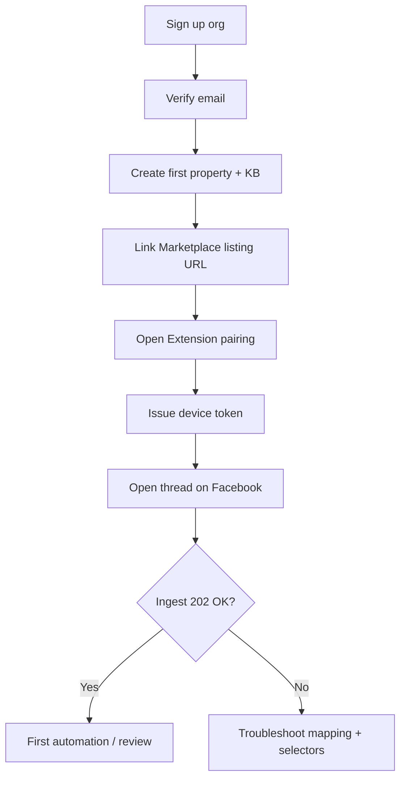
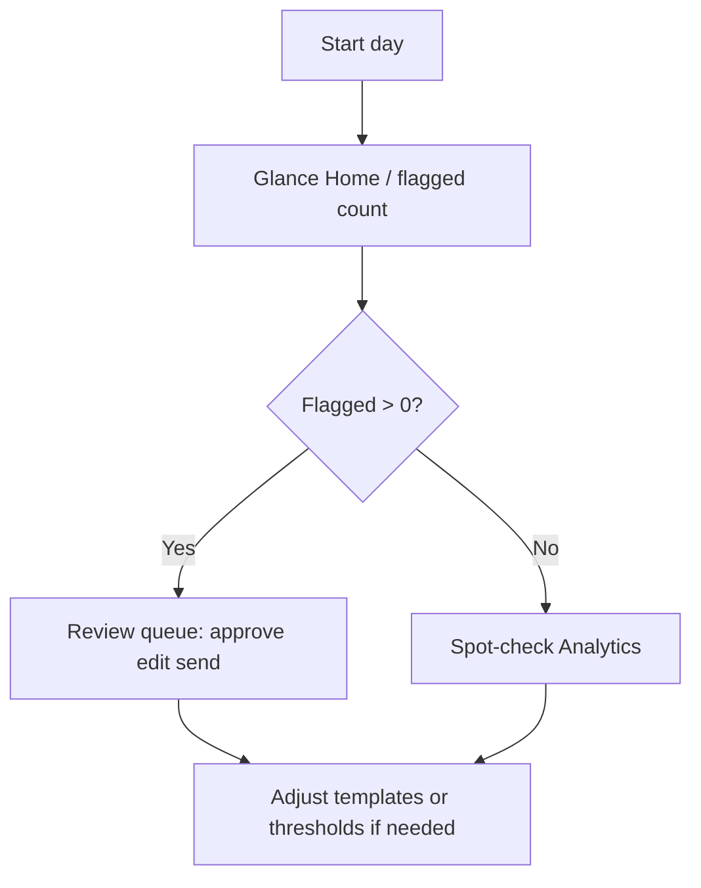
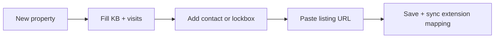

# UX/UI Design — Facebook Marketplace Auto-Responder

**Version**: 1.0  
**Inputs**: `artifacts/product-requirements.md`, `artifacts/conversation-system-design.md`, `artifacts/system-architecture.md`  
**Wireframes**: ASCII art (per orchestration). **Flows**: Mermaid.js only.

---

## 1. Information Architecture & Navigation

**Primary nav (dashboard)** — maps to US-1–US-13 and F-01–F-15 in product requirements:

| Top-level | Purpose |
|-----------|---------|
| Home | Overview KPIs, flagged count, shortcuts |
| Properties | KB, listings, contacts, lockbox, Drive URL |
| Conversations | All threads; filters; link to review |
| Review queue | Human-in-the-loop (US-10) |
| Screening | Scores, criteria breakdown (US-7) |
| Analytics | Volumes, response time, conversion (US-13) |
| Settings | Tone, templates, thresholds, integrations, extension tokens |

**Roles (MVP)**  

- Org admin: full access.  
- Member (optional later): read conversations + review only.

---

## 2. Browser Extension UI (ASCII)

### 2.1 Popup — connected / auto mode

```
+----------------------------------------------------------+
|  FMAR                                    [ gear options ] |
+----------------------------------------------------------+
|  ● Connected    Seller: Marie D.                        |
|  Mode:  [====Auto-respond====]  |  Paused                |
+----------------------------------------------------------+
|  Current thread                                          |
|  Listing: 3 1/2 — 4731 Chabot (mapped OK)               |
|  State: Screening        Score: 78/100                    |
+----------------------------------------------------------+
|  Today                                                    |
|   Auto-sent: 23      Flagged: 3       Failed sends: 0    |
+----------------------------------------------------------+
|  [ Pause auto-respond ]     [ Open review queue ]         |
|  [ Open dashboard ]         [ Sign out device ]           |
+----------------------------------------------------------+
  * Badge on icon shows flagged count when > 0
```

### 2.2 Popup — paused / needs auth

```
+----------------------------------------------------------+
|  FMAR                                                     |
+----------------------------------------------------------+
|  ○ Disconnected — sign in from dashboard to pair device   |
|                                                           |
|  [ Open pairing page ]                                    |
+----------------------------------------------------------+
|  Last error: 401 — token expired (2 min ago)              |
+----------------------------------------------------------+
```

### 2.3 In-page chip (minimal overlay)

```
   +------------------------+
   | FMAR  Auto  |  : menu |
   +------------------------+
   * Draggable; remembers X/Y
   * Red dot when flagged for this thread
```

**Annotations**

- **Pause** must be one click with confirm if user prefers (Setting: skip confirm).  
- **Open review queue** deep-links to `/review-queue?conversation_id=…` when context known.

---

## 3. Dashboard Pages (ASCII)

### 3.1 Home / Overview

```
+--------------------------------------------------------------------------------+
| [Logo] FMAR     Home   Properties   Conversations   Review   Screening   ...   |
+--------------------------------------------------------------------------------+
| Good afternoon, Marie                                    [ FR | EN ]  [ user v ] |
+--------------------------------------------------------------------------------+
|  TODAY                                                                          |
|  +----------------+ +----------------+ +----------------+ +----------------+ |
|  | First response | | Auto-sent       | | Open reviews  | | Active threads | |
|  |   12m median   | |      23        | |      3        | |      15        | |
|  +----------------+ +----------------+ +----------------+ +----------------+ |
+--------------------------------------------------------------------------------+
|  NEEDS ATTENTION (Review queue)                              [ View all ]        |
|  +----------------------------------------------------------------------------+|
|  | !  Jean D.   Chabot      Credit/TAL unclear          18m ago    [Review]   ||
|  | !  Ana R.    Gardenville Visit + scam hint            1h ago    [Review]   ||
|  +----------------------------------------------------------------------------+|
+--------------------------------------------------------------------------------+
|  RECENT ACTIVITY                                                                |
|  Auto-sent  Gardenville  "Oui disponible 1er juillet..."           2m ago      |
|  Flagged     Cartier     escalation:review                          6m ago      |
+--------------------------------------------------------------------------------+
```

### 3.2 Properties — list

```
+--------------------------------------------------------------------------------+
| ... nav ...                                                                     |
+--------------------------------------------------------------------------------+
| Properties                                                    [ + New property ]|
| Search [_________________________]  Status [ All v ]                            |
+--------------------------------------------------------------------------------+
| Name           | Listings | Status    | Next avail. | Updated    | Actions     |
|----------------|----------|-----------|-------------|------------|-------------|
| Chabot         |    2     | Available | 2026-07-01  | Today      | Edit  List  |
| Gardenville    |    1     | Rented    | —           | Yesterday  | Edit  List  |
+--------------------------------------------------------------------------------+
```

### 3.3 Property — detail / KB editor

```
+--------------------------------------------------------------------------------+
| Properties > Chabot                                              [ Save ] [Back]|
+--------------------------------------------------------------------------------+
| Tabs: [ General ] [ Knowledge base ] [ Visits ] [ Contacts ] [ Integrations ]   |
+--------------------------------------------------------------------------------+
| KNOWLEDGE BASE                                                                  |
| Rent (monthly)    [ 1200 ]    Avail. date [ 2026-07-01 ]   Furnished [x]       |
| Pets policy       [textarea: no pets______________________________]            |
| Smoking           ( ) Non-smoking only  ( ) Smoking ok                           |
| Utilities inc.    [x] Heat  [x] Water  [ ] Electricity                           |
| Appliances        [tag: fridge] [tag: stove]  + Add                           |
| Public notes      [textarea for LLM_____________________________]              |
| Internal notes    [textarea staff only___________________________]             |
+--------------------------------------------------------------------------------+
| VISITS (summary on this tab)                                                    |
| Mode: ( ) Lockbox   (*) Contact person   ( ) Hybrid                            |
| Lockbox code      [******]  (hidden until screening release — see tooltip)     |
| Instructions      [textarea_____________________________________]               |
+--------------------------------------------------------------------------------+
```

### 3.4 Listings under property

```
+--------------------------------------------------------------------------------+
| Chabot > Listings                                            [ + Link listing ] |
+--------------------------------------------------------------------------------+
| Marketplace URL (paste)  [https://www.facebook.com/marketplace/item/...] [Go] |
| Title snapshot            [read-only from last sync: 3 1/2 ...]                 |
| Mapped property           Chabot (change)                                       |
+--------------------------------------------------------------------------------+
```

### 3.5 Conversations — list

```
+--------------------------------------------------------------------------------+
| Conversations                                                                   |
| Property [ All v ]  State [ All v ]  Flagged only [ ]  Search buyer [______]   |
+--------------------------------------------------------------------------------+
| Property      | Buyer (FB) | State      | Score | Last message      |        |
|---------------|------------|------------|-------|-------------------|--------|
| Chabot        | Jean D.    | Screening  | 78    | "Juillet ok" 3m   | Open   |
| Gardenville   | Ana R.     | Flagged    | 45    | "Wire transfer?"  | Open   |
| 6e Ave        | Paul R.    | Completed  | 92    | "Merci!" 1d       | Open   |
+--------------------------------------------------------------------------------+
```

### 3.6 Conversation — detail (review + thread)

```
+--------------------------------------------------------------------------------+
| Conversations > Jean D. — Chabot                        [ FR | EN ]  [Resolve] |
+--------------------------------------------------------------------------------+
| +------------------------------------+  +------------------------------------+ |
| | THREAD                             |  | CONTEXT                            | |
| |------------------------------------|  | Property: Chabot                   | |
| | [them] Dispo juillet?              |  | $1200 | Avail Jul 1               | |
| | [auto] Oui, pour quelle date...    |  | Pets: no | Non-smoking            | |
| | [them] Juillet, bon credit         |  | Visit: Contact M. X 514-...       | |
| | [auto] Animaux? Fumeur?            |  | Screening: 78/100  [see breakdown]| |
| | [pending draft — review]           |  | State: SCREENING                   | |
| |   "Merci! ... visite ..."         |  | Escalation: none                   | |
| |   [ Edit text area______________ ] |  |                                    | |
| |   [ Approve & send ] [ Reject ]    |  | Templates: [ Reject v ] [ Insert ] | |
| +------------------------------------+  +------------------------------------+ |
+--------------------------------------------------------------------------------+
| * Auto-sent bubbles use subtle robot icon; human-sent use avatar               |
+--------------------------------------------------------------------------------+
```

### 3.7 Review queue — focused list

```
+--------------------------------------------------------------------------------+
| Review queue                                                    [ Bulk ... v ]  |
| Sort: [ Oldest first v ]    Filter: [ All reasons v ]                           |
+--------------------------------------------------------------------------------+
| Age   | Conversation      | Reason codes              | Actions               |
|-------|--------------------|---------------------------|-----------------------|
| 18m   | Jean D. / Chabot | tal_unclear, low_score      | Review                |
| 1h    | Ana R. / Garden   | scam_hint                   | Review                |
+--------------------------------------------------------------------------------+
```

### 3.8 Screening — tenant view

```
+--------------------------------------------------------------------------------+
| Screening > Jean D.                                                             |
+--------------------------------------------------------------------------------+
| Aggregate score   78 / 100        Thresholds: auto>=72  flag<55               |
| +-----------------------------+ +-----------------------------+               |
| | Criterion        | Score    | | Timeline                    |               |
| | Credit self      | 85       | | t0  ingest                  |               |
| | TAL              | 90       | | t1  pets answered           |               |
| | Pets match       | 100      | | ...                         |               |
| | Smoking          | 100      | |                             |               |
| +-----------------------------+ +-----------------------------+               |
+--------------------------------------------------------------------------------+
```

### 3.9 Analytics

```
+--------------------------------------------------------------------------------+
| Analytics                                                                       |
| Range [ Last 7 days v ]   Compare [ Previous period v ]   Property [ All v ]  |
+--------------------------------------------------------------------------------+
| [ Line chart: conversations per day ]                                         |
| [ Line chart: median first response time ]                                    |
| [ Bar: auto vs human handled ]                                                 |
| [ Funnel: inquiry -> visit proposed -> confirmed ]                             |
+--------------------------------------------------------------------------------+
| Table: per-property rollup                                    [ Export CSV ]   |
+--------------------------------------------------------------------------------+
```

### 3.10 Settings

```
+--------------------------------------------------------------------------------+
| Settings                                                                        |
| [ Organization ] [ Tone & templates ] [ Screening thresholds ] [ Integrations ]|
| [ Extension devices ] [ Billing — later ]                                       |
+--------------------------------------------------------------------------------+
| TONE PROFILES                                                                   |
| Default: [ Professional neutral v ]                                             |
| Custom instructions (max 500 chars)                                             |
| [________________________________________________________]                      |
|                                                                                 |
| EXTENSION DEVICES                                                               |
| Device ID        Last seen      Actions                                         |
| chrome-abc...    2026-03-31     Revoke                                          |
+--------------------------------------------------------------------------------+
```

---

## 4. User Flow Diagrams (Mermaid)

### 4.1 Onboarding



### 4.2 Daily landlord workflow



### 4.3 Property setup



---

## 5. Component Specifications

| Component | Behavior | States |
|-----------|----------|--------|
| `StatusBadge` | conversation state | screening, flagged, completed, rejected |
| `ScoreIndicator` | 0–100 + color bands | green ≥72, amber 55–71, red <55 |
| `MessageBubble` | direction, auto/human | icons, timestamps |
| `ReviewActions` | approve, reject, template insert | disabled until text valid |
| `DataTable` | sort, filter, paginate | loading, empty |
| `KpiCard` | metric + delta | loading, error |
| `ThreadChip` | extension mini status | connected / paused / error |

**Keyboard (conversation detail)**

- `A` — Approve (when focus in review panel)  
- `E` — Focus editor  
- `J/K` — Next/prev review task (queue page)

---

## 6. Responsive Design Guidelines

| Breakpoint | Layout |
|------------|--------|
| ≥1280px (desktop) | Full split thread + context panel |
| 768–1279px (tablet) | Tabs: Thread / Context; collapsible nav |
| <768px (mobile) | Single column; context in bottom sheet; prioritize Review queue |

Tables become **card lists** on mobile; primary action sticky bottom on review screens.

---

## 7. Bilingual UI Considerations

- **Dashboard chrome**: Vue I18n keys `en`, `fr-CA` (Quebec strings where different).  
- **User-generated content**: KB, templates — store locale tag per template row.  
- **Extension popup**: inherits dashboard language preference via sync’d setting `ui_locale` (`storage.sync` safe — no secrets).  
- **Dates**: `Intl` with org timezone from `organizations.timezone`.

---

## 8. Accessibility Guidelines

- WCAG 2.1 AA target: contrast for badges, focus rings on all interactive elements.  
- Live regions for “new review task” toasts.  
- Icon-only buttons have `aria-label`.  
- Conversation thread in scroll region with keyboard scroll; not trap focus.  
- Reduced motion: disable non-essential animations via `prefers-reduced-motion`.

---

## 9. Design System Foundations (Tailwind-compatible)

| Token | Value | Usage |
|-------|-------|--------|
| `color-primary` | `#2563eb` | Links, primary buttons |
| `color-danger` | `#dc2626` | Flagged, errors |
| `color-success` | `#16a34a` | Auto-sent OK, high score |
| `color-surface` | `#f8fafc` / dark `#0f172a` | Page bg (theme later) |
| `font-sans` | system-ui stack | UI |
| `text-base` | 16px | Body |
| `spacing-section` | 24px | Between cards |
| `radius-card` | 12px | Cards |
| `shadow-card` | sm/md | Elevated panels |

---

## Definition of Done (UX/UI Designer)

- [x] IA + extension popup/chip ASCII.  
- [x] Dashboard pages: Home, Properties, Property KB, Listings, Conversations, Conversation detail, Review, Screening, Analytics, Settings.  
- [x] Mermaid flows: onboarding, daily workflow, property setup.  
- [x] Components, responsive, bilingual, a11y, design tokens.  
- [x] Mapped to product stories US-1–US-13 and review/screening flows from `conversation-system-design.md`.
